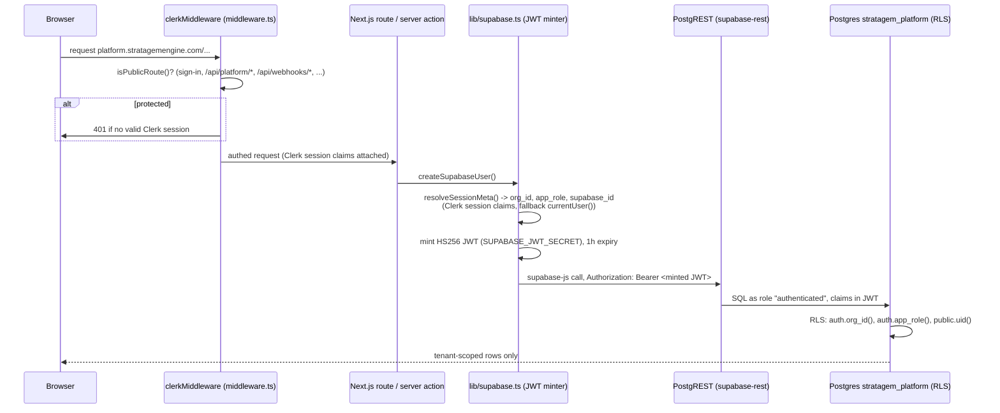

# 10 September 2026 — Production Deployment (Source of Truth)

> **Status:** AUTHORITATIVE. This document supersedes `DEPLOYMENT.md` and
> `ADMIN_GUIDE.md`, which describe the retired DigitalOcean droplet and are now
> **historical reference only**.
>
> Source-of-truth hierarchy: **live HetzCloud environment → app/infra code →
> Terraform → this document → (historical) DigitalOcean docs.**

---

## 1. Production Overview

| | |
|---|---|
| **Provider** | HetzCloud (Hetzner Cloud) |
| **Environment** | Production |
| **Platform** | StratagemEngine Simulation Platform |
| **Date reconciled** | 10 September 2026 |
| **Topology** | Single shared host, container-per-app, Coolify + Traefik control plane |
| **Server** | `coolify-server` (Hetzner Cloud ID `163952663`), `cx43`, Falkenstein `fsn1` |
| **Public IPv4** | `46.224.15.73` |
| **Public IPv6** | `2a01:4f8:c014:6336::/64` (host `::1`) |
| **Terraform state** | local, `serial 10`, providers `hcloud`, `local`, `null` (no DigitalOcean) |
| **Verification** | live SSH + Hetzner API inspection, 2026-09-10 |

The previous DigitalOcean droplet (`web-01`, `165.227.101.246`, `nyc3`,
`s-2vcpu-4gb`, host-Nginx + certbot + systemd) **no longer exists in the
Terraform configuration or state** (only `terraform.tfstate.do.backup` and
`_backup/tfstate-2026-09-09.json` retain it, as historical artefacts).

---

## 2. Architecture Principles

1. **Production infrastructure is hosted on HetzCloud.** One `cx43` server in
   `fsn1`, provisioned by Terraform, bootstrapped with Coolify via cloud-init.
2. **Production uses one authoritative production database instance.** A
   Coolify-managed **PostgreSQL 18** container (`om3fwlitdodg2ckjxbwhorn6`,
   volume `postgres-data-om3fwlitdodg2ckjxbwhorn6`). The main platform and most
   simulations use a dedicated **logical database** on this instance. Three
   simulations still run their own Postgres/SQLite container (documented in §6
   and §12 as drift to converge, not as approved architecture).
3. **Supabase is NOT the production database and NOT the production auth system.**
   A self-hosted PostgREST + Storage + Realtime trio (`/opt/apps/supabase`) runs
   as a **thin data-access API in front of the authoritative Postgres** for the
   main platform only. There is **no Supabase Postgres, no Supabase GoTrue/Auth,
   and no Supabase cloud project** in production. See §7 and the Supabase
   classification table in §13.
4. **Clerk is the authentication provider** for the main platform. Simulations
   do not embed Clerk; they authenticate to the platform server-to-server with
   hashed API keys (`stgm_sk_…`) and, where integrated, verify platform-issued
   learner sessions over HTTPS.
5. **Terraform is the Infrastructure-as-Code source of truth** for the HetzCloud
   layer (server, firewall, SSH key). The application layer (Coolify, Traefik,
   all app containers, the database container, DNS, TLS) is currently **managed
   outside Terraform** — this is the known IaC gap (§12).
6. **The main platform + simulation subsites form one production ecosystem.**
   `platform.stratagemengine.com` is the hub; each simulation is a subdomain of
   `stratagemengine.com` served from the same host behind the same proxy.

---

## 3. Architecture Diagram

```mermaid
flowchart TB
    user([Learner / Instructor])
    registrar[Namecheap DNS<br/>dns1/2.registrar-servers.com]
    vercel[Vercel<br/>www.stratagemengine.com only]

    user -->|DNS| registrar
    registrar -->|"*.stratagemengine.com A -> 46.224.15.73"| traefik
    registrar -->|"www CNAME"| vercel

    subgraph HZ["HetzCloud - coolify-server (cx43, fsn1, 46.224.15.73)"]
        direction TB
        fw[[Hetzner Cloud Firewall<br/>coolify-server-fw: 22, 80, 443]]
        traefik[coolify-proxy / Traefik v3.6<br/>:80 :443 - Let's Encrypt]

        subgraph COOLIFY["Coolify control plane"]
            coolify[coolify 4.3.18]
            cfdb[(coolify-db pg15)]
            cfredis[(coolify-redis)]
            cfrt[coolify-realtime]
            sentinel[coolify-sentinel]
        end

        subgraph APPS["Application containers (/opt/apps, docker compose, coolify network)"]
            platform[app_platform<br/>Next.js 14 + Clerk]
            sb[supabase-rest / -storage / -realtime<br/>PostgREST layer]
            www[app_www<br/>nginx static - apex]
            leadership[leadership]
            autorevive[autorevive x6 + redis]
            aitransformer[aitransformer + backend + redis]
            fmcg[fmcg web + backend + redis]
            macrolab[macrolab web + api - SQLite]
            zerotopmf[zerotopmf web + api + worker + redis]
            studio[professorstudio / casestudio]
            airl[airevenueleakage + own db]
        end

        subgraph DB["Authoritative production database"]
            pg[("om3fwlitdodg2ckjxbwhorn6<br/>PostgreSQL 18 (Coolify-managed)<br/>DBs: stratagem_platform, leadership_db,<br/>autorevive, zerotopmf, simulationstudio_db,<br/>fmcg, venturefund")]
        end

        subgraph PERSIM["Per-simulation databases (drift to converge)"]
            aidb[(aitransformer_db pg16 - aets)]
            airldb[(db_airevenueleakage pg15 - ai_revenue_assurance)]
            mlsqlite[(macrolab SQLite volume)]
        end

        fw --> traefik
        traefik --> platform & www & leadership & autorevive & aitransformer
        traefik --> fmcg & macrolab & zerotopmf & studio & airl
        traefik -->|"/rest/v1 /storage/v1 /realtime/v1"| sb

        platform -->|"supabase-js -> PostgREST -> RLS"| sb
        sb --> pg
        leadership --> pg
        autorevive --> pg
        zerotopmf --> pg
        studio --> pg
        fmcg --> pg
        aitransformer --> aidb
        airl --> airldb
        macrolab --> mlsqlite
    end

    subgraph EXT["External SaaS (platform)"]
        clerk[Clerk - auth]
        upstash[Upstash Redis]
        inngest[Inngest - jobs]
        stripe[Stripe - billing]
        resend[Resend - email]
        anthropic[Anthropic API]
        posthog[PostHog / Sentry]
        m365[Microsoft 365 - MX]
    end

    platform --- clerk
    platform --- upstash
    platform --- inngest
    platform --- stripe
    platform --- resend
    platform --- anthropic
    platform --- posthog
```



---

## 4. HetzCloud Infrastructure (verified via Hetzner API, 2026-09-10)

### 4.1 Compute

| Attribute | Value |
|---|---|
| Server name | `coolify-server` |
| Hetzner ID | `163952663` |
| Server type | `cx43` — shared vCPU, `cost_optimized` |
| CPU | 8 vCPU (x86, shared, `AMD`) |
| RAM | 16 GB |
| Disk | 160 GB local NVMe (`primary_disk_size = 160`, `storage_type: local`) |
| Image / OS | `ubuntu-24.04` → running kernel `6.8.0-137-generic`, Ubuntu 24.04.4 LTS |
| Location | `fsn1` — Falkenstein DC Park 1, Germany, `eu-central` |
| Status | `running` (up 11 days at inspection) |
| Delete protection | **false** |
| Rebuild protection | **false** |
| Placement group | none |
| Attached volumes | none |
| Private networks | none (`private_net: []`) |
| Floating / extra IPs | none |
| Load balancers | none |
| Backups (Hetzner) | **disabled** (`backups: false`, `backup_window: null`) |
| Snapshots | none |
| Host utilisation (2026-09-10) | load ~1.1, 3.9 GB/16 GB RAM used, 33 GB/150 GB disk used, swap idle |

### 4.2 Networking

| | |
|---|---|
| Public IPv4 | `46.224.15.73` (primary IP `147143829`, `auto_delete: true`) |
| Public IPv6 | `2a01:4f8:c014:6336::/64` (primary IP `147143830`) |
| Reverse DNS | `static.73.15.224.46.clients.your-server.de` (Hetzner default, not customised) |
| Private networking | not used |

### 4.3 Firewall

**`coolify-server-fw`** (Hetzner ID `11539288`), applied to the server, inbound only:

| Port | Protocol | Source | Purpose |
|---|---|---|---|
| 22 | TCP | `0.0.0.0/0`, `::/0` | SSH |
| 80 | TCP | `0.0.0.0/0`, `::/0` | HTTP (Traefik → HTTPS redirect + ACME) |
| 443 | TCP | `0.0.0.0/0`, `::/0` | HTTPS (Traefik) |

**Port 8000 (Coolify dashboard) was removed 2026-09-11 (P0 #2)** — from the
Hetzner firewall and from host `ufw`. Reach the UI through an SSH tunnel:
`ssh -i ./ssh/production-infra-key -L 8000:localhost:8000 root@46.224.15.73`,
then `http://localhost:8000`. Nothing depended on inbound 8000 (0 Coolify apps,
no FQDN, no webhooks). Verified: `:8000` from the internet now fails to connect;
`terraform plan` clean; SSH tunnel to the dashboard works.

Outbound: unrestricted (Hetzner default). Host `ufw` now mirrors the cloud
firewall (`22/80/443` only); the Hetzner Cloud Firewall is the effective control.

Additional host ports bound to `0.0.0.0` by Docker (**not** in the Hetzner
firewall allow-list, so not reachable from the internet, but reachable on the
host / over a tunnel): `8000` (Coolify), `8080` (Traefik dashboard),
`6001`/`6002` (coolify-realtime), `5433` (**legacy fmcg Postgres — orphaned,
see §6/§12**), `8082` (a second leadership container, see §6).

### 4.4 SSH

| | |
|---|---|
| Key name (Hetzner) | `production-infra-key` (ID `118084486`) |
| Type | `ed25519`, fingerprint `10:38:1f:1d:5b:ca:98:53:71:1e:e9:da:6b:9f:52:86` |
| Private key | `./ssh/production-infra-key` in this repo (gitignored, never in TF state) |
| Server access | `root` only, key-only (password auth disabled by image default) |
| Coolify SSH | Coolify manages the host over its own key in `/data/coolify/ssh` |

### 4.5 Runtime

| Component | Version / detail |
|---|---|
| Docker Engine | `29.7.2` |
| Docker Compose | v2 plugin (`5.5.0`) |
| Orchestration | Coolify `4.3.18` (Laravel 12.65.0) — control plane only |
| Reverse proxy | **Traefik v3.6** (`coolify-proxy`), owns `:80` `:443` `:8080` |
| TLS | Let's Encrypt via Traefik `certResolver=letsencrypt`, `acme.json` in `/data/coolify/proxy` |
| Host Nginx | **none** (retired with the droplet; `app_www` runs `nginx:alpine` *inside* a container for static apex only) |
| Host systemd app units | **none** (`zerotopmf.service` / `simulationstudio.service` from the DO box do not exist here — both apps are containers now) |
| Node / Python on host | not used for app runtime — everything builds inside containers |

---

## 5. Application Architecture

All application containers are deployed **manually** via `docker compose` from
`/opt/apps/<App>/docker-compose*.yml`, attached to the external `coolify`
Docker network, and exposed through Traefik using container labels. Coolify is
**not** deploying or building these apps (its `applications` registry is empty);
it manages only the proxy, its own stack, and the one database (§6).

| Application | Domain(s) | Runtime | Compose project | Internal port | Database | End-user auth |
|---|---|---|---|---|---|---|
| **StratagemEngine platform** | `platform.stratagemengine.com` | Next.js 14 (standalone) | `platform` (`/opt/apps/platform`) | 3000 | `stratagem_platform` on authoritative PG, **via PostgREST** | **Clerk** |
| Marketing / apex | `stratagemengine.com` (apex) | `nginx:alpine` static (`app_www`) | `www` | 80 | none | none |
| Marketing / www + apex | `www.stratagemengine.com`, `stratagemengine.com` | `app_www` (`nginx:alpine`, hardened `deploy/default.conf`) on the box, valid Let's Encrypt cert (SAN covers both) since 2026-09-11. Vercel removed. | 80 | — | none | none |
| Contact-form API (`www` repo, `api/`) | same domains, `PathPrefix(/api)`, Traefik priority 100 | Node 22 + Express + `pg` (`app_api`), added 2026-09-11 | 3000 | own `postgres:16-alpine` (`contacts-db`), DB `contacts`, role `contacts_app` (least-privilege, not superuser) | none (public endpoint; honeypot + in-memory per-IP rate limit) |
| Leadership Simulation | `leadership.stratagemengine.com` | Flask + Gunicorn | `leadership` | 8000 | `leadership_db` on authoritative PG | shared `FACULTY_PASSWORD` for dashboard; learners unauthenticated / launched from platform |
| AutoRevive Dynamics | `autorevive.stratagemengine.com` | FastAPI + Celery worker + Celery beat + Next.js frontend + internal Nginx + Redis (6 containers) | `autorevive` | 80 (internal nginx) | `autorevive` on authoritative PG; **own Redis** | own JWT (`SECRET_KEY`, local accounts) |
| AI Enterprise Transformation | `aitransformer.stratagemengine.com` (+ `/api`, `/ws`) | Next.js frontend + FastAPI backend | `infra` (`docker-compose.coolify.yml`) | 3000 / 8000 | **own `postgres:16` container** (`app_aitransformer_db`, DB `aets`) + **own Redis** | own JWT |
| FMCG Simulator | `fmcg.stratagemengine.com` | Vite static (`Dockerfile.web`) + FastAPI backend + Redis | `fmcg-simulataor` | 80 / 8000 | `fmcg` on authoritative PG (per `docker-compose.prod.yml`); **legacy local `postgres:16` still running, orphaned** | own JWT secret |
| MacroLab | `macrolab.stratagemengine.com` | Vite static + Node/Express API | `macrolab` | 80 / 3001 | **SQLite** (`file:/app/data/macrolab.db`, volume `macrolab_sqlite_data`) | session cookie (`SESSION_TTL`) |
| ZeroToPMF | `zerotopmf.stratagemengine.com` | Vite static + FastAPI API + `arq` worker + Redis | `zerotopmf` | 80 / 8001 | `zerotopmf` on authoritative PG; **own Redis** | **platform session verification** (`PLATFORM_VERIFY_SESSION_URL`, `SIM_API_KEY`, `EXTERNAL_SIM_ID`) |
| Simulation Studio (instructor authoring) | `professorstudio` / `casestudio` / `studio` `.stratagemengine.com` | Next.js (own `/api/*`) | `simulationstudio` | 3002 | `simulationstudio_db` on authoritative PG | Next.js app-level (was "external Supabase" on the droplet — **migrated**) |
| AI Revenue Leakage | `revsure.smartagentx.ai` (moved 2026-09-11; was `airevenueleakage.stratagemengine.com`, kept as a 301 redirect) | Next.js/Node app | `airevenueleakage` | 3000 | **own `postgres:15` container** (`db_airevenueleakage`, DB `ai_revenue_assurance`), on an isolated bridge network | app-level |
| Supabase data layer (platform only) | `platform.stratagemengine.com/{rest,storage,realtime}/v1` | PostgREST `v12.2.0`, storage-api `v1.75.0`, realtime `v2.134.12` | `supabase` (`/opt/apps/supabase`) | 3000 / 5000 / 4000 | **points at `stratagem_platform` on the authoritative PG** | JWT (HS256) minted by the platform from Clerk identity |
| **SmartAgentX.ai** | `smartagentx.ai`, `www.smartagentx.ai` | `nginx:1.27-alpine` static (`app_smartagentx_web`) | `smartagentx` (`/opt/apps/smartagentx`) | 80 | none | none |
| Venture Fund simulation | *(none — `venturefund` DB exists, no app deployed)* | — | — | — | `venturefund` on authoritative PG (empty/unused) | — |

Support containers: `coolify`, `coolify-db` (`postgres:15`), `coolify-redis`,
`coolify-realtime`, `coolify-sentinel`, `coolify-proxy` (Traefik).

**Health at inspection (2026-09-10):** platform `401` (Clerk gate — healthy),
leadership/aitransformer/fmcg/macrolab/zerotopmf/airevenueleakage `200`,
autorevive/professorstudio/casestudio `307` (by design). All compose projects
`running` except the expected one-shot `zerotopmf-migrate` (`Exited 0`).

---

## 6. Database Architecture

### 6.1 Authoritative production database

| | |
|---|---|
| Engine | **PostgreSQL 18** (`postgres:18-alpine`) |
| Container | `om3fwlitdodg2ckjxbwhorn6` |
| Managed by | **Coolify** (`coolify.managed=true`, `databaseId=1`, project `my-first-project`, env `production`, `subType=standalone-postgresql`) |
| Compose | `/data/coolify/databases/om3fwlitdodg2ckjxbwhorn6/docker-compose.yml` |
| Data volume | `postgres-data-om3fwlitdodg2ckjxbwhorn6` (Docker named volume, local disk) |
| Network | `coolify` (Docker bridge) — **not published to the host**, reachable only as `om3fwlitdodg2ckjxbwhorn6:5432` inside the network |
| Superuser | `postgres` (credentials in the Coolify DB compose + each app's env/compose — **not reproduced here**) |
| Health | `running:healthy` |

**Logical databases on this instance:**

| Database | Consumer | Notes |
|---|---|---|
| `stratagem_platform` | main platform (via PostgREST), `supabase-rest/-storage/-realtime` | schemas: `public`, `auth`, `storage`, `realtime`, `_realtime`. `auth` schema holds RLS helper functions + PostgREST role mapping — **not** Supabase GoTrue. |
| `leadership_db` | Leadership Simulation | |
| `autorevive` | AutoRevive Dynamics | migrated off its droplet-era dedicated Postgres container |
| `zerotopmf` | ZeroToPMF | migrated off its droplet-era local Postgres |
| `simulationstudio_db` | Simulation Studio | new — droplet doc said "external Supabase, no local DB" |
| `fmcg` | FMCG Simulator (per `docker-compose.prod.yml`) | the orphaned local `fmcg` container was removed 2026-09-11 — see §12 #4 |
| `venturefund` | *(none)* | provisioned ahead of a not-yet-deployed simulation |
| `aets` | AI Enterprise Transformation | converged 2026-09-11 off its own container (`app_aitransformer_db`); role `aets_app`, data migrated via `pg_dump`/`pg_restore`, verified via live query through the running backend before cutover — see §12 #3, §15 changelog |
| `ai_revenue_assurance` | AI Revenue Leakage | converged 2026-09-11 off its own container (`db_airevenueleakage`); role `ai_revenue_assurance_app` — a brand-new least-privilege credential, not a reuse of the previously hardcoded `POSTGRES_PASSWORD` default (repo-side fix for that hardcoding still open, see §12 #6). Data migrated via `pg_dump`/`pg_restore`, verified via the app's own boot-time migrate+seed cycle against the new location — see §12 #3, §15 changelog |
| `contacts` | Contact-form API (`www`/`api`) | converged 2026-09-11 off its own Coolify-managed container (`contacts-db-coolify`); role `contacts_app` reused (name only — fresh password), verified via a real `/api/contact` submission + honeypot check against the new location. **Deliberate tradeoff:** this DB was previously isolated in its own container on purpose (public-write, low-trust ingest); merged onto the shared instance at the user's request so every app DB is visible in one place. Role-level least-privilege isolation remains. See §12 #3, §15 changelog |
| `postgres` | default maintenance DB | |

### 6.2 Databases NOT on the authoritative instance (drift — see §12)

| Store | App | Location | Classification |
|---|---|---|---|
| SQLite file, volume `macrolab_sqlite_data` | MacroLab | container-local | **in-use** — acceptable for low-write sim, but not backed up |
| Droplet-era `autorevive` / `zerotopmf` / AET Postgres on the old DO box | — | DigitalOcean (destroyed) | **REMOVED** |
| Ex-`contacts-db-coolify` (`rg2p3c5ipuuti98wog46z3y8`) | Contact-form API (`www`/`api`) | was `coolify` network | **CONVERGED 2026-09-11** — see §6.1 `contacts` row. Container removed (volume `postgres-data-rg2p3c5ipuuti98wog46z3y8` kept as a safety net); the Coolify dashboard's resource record for it still needs a deliberate manual deletion (with explicit volume-retention confirmation — its delete API can default to also destroying the volume, deliberately not risked via a scripted call) as a follow-up during the confidence period. |

### 6.3 Redis

- **Platform:** Upstash (external, `UPSTASH_REDIS_REST_URL`) — no local Redis for the platform.
- **Simulations:** local `redis:7-alpine` container per app (autorevive, zerotopmf, fmcg, aitransformer). Coolify has its own `coolify-redis`.

### 6.4 Backups

**Partially remediated 2026-09-10 (P0):**

- **Installed:** `/opt/backups/run-backup.sh` (now also tracked in this repo at
  `deploy/backups/run-backup.sh`) + root cron `30 2 * * *`. Each run
  writes `/opt/backups/dumps/<timestamp>/` — `pg_dump -Fc` of every database on
  the authoritative instance (+ `pg_dumpall --globals-only`), the per-sim
  Postgres containers (`aets`, `ai_revenue_assurance`, `contacts` — added
  2026-09-11), the orphaned local `fmcg`, and a tar of the MacroLab SQLite
  volume; `SHA256SUMS` per set; 14-day local retention. First run
  `20260910-130004` verified (`pg_restore --list` OK). One off-box copy pulled
  to `_backup/db/` on the maintainer workstation (gitignored).
- **Still open (P1):** (a) the local dumps share the server's disk — an
  **automated off-host push** (S3 / Backblaze via Coolify's `save_s3` or an
  `rclone` step in the script) is still required; (b) **no Hetzner Cloud
  backups / snapshots** (`backups: false`) — enable `backups = true` on
  `hcloud_server.coolify` (needs `apply`) or a snapshot schedule; (c) add a
  restore drill to the runbook; (d) alert on backup failure (cron is silent).
- MacroLab note: `/app/data/macrolab.db` on the volume is **0 bytes** — the sim
  is not persisting to its configured SQLite file (baked-in `dev.db` from Jun 18
  is what ships in the image). Migrations may not be running on startup.
  Backups capture the volume regardless; the persistence bug is tracked in §12.

---

## 7. Clerk Authentication

**Provider:** Clerk (`@clerk/nextjs` v5). Applies to the **main platform only**.

### 7.1 Platform request flow



### 7.2 Key facts

- **`lib/supabase.ts` is the only DB entry point** for the platform. It does
  **not** use Supabase Auth — it mints its own `{"alg":"HS256"}` JWT carrying
  Clerk-derived claims because PostgREST verifies a plain shared secret.
- **User provisioning:** Clerk webhook → `/api/webhooks/clerk`
  (`CLERK_WEBHOOK_SECRET`) → `lib/provision-user.ts` → `users` row in Postgres
  (`clerk_user_id TEXT`, `id UUID`). JIT fallback `ensureUserRow()` covers
  dropped/late webhooks.
- **Identity mapping:** Clerk `user_…` ID ↔ `users.clerk_user_id`;
  `public_metadata` / session claims carry `org_id`, `app_role`, `supabase_id`.
- **Two Supabase clients:** `createSupabaseUser()` (RLS-enforced, per-request
  minted token) and `createSupabaseAdmin()` (service-role, RLS-bypass —
  quarantined to webhooks, crons, `/api/super/*`, `write_completion()`).
- **Admin:** `SUPER_ADMIN_CLERK_USER_ID` / `SUPER_ADMIN_EMAIL`.
- **Secrets:** `CLERK_SECRET_KEY`, `CLERK_WEBHOOK_SECRET`,
  `NEXT_PUBLIC_CLERK_PUBLISHABLE_KEY` live only in
  `/opt/apps/platform/.env.production` on the host. Never in git, never in TF.

### 7.3 Simulation authentication (not Clerk)

| Mechanism | Used by | Detail |
|---|---|---|
| Server-to-server API keys | all sims that call the platform | `stgm_sk_<base64url>`, SHA-256 hashed, stored in `sim_api_keys`, scoped per-simulation × per-environment (`staging`/`production`). Verified by `lib/sim-api-key.ts`. Platform routes `/api/platform/*`, `/api/learner/*`, `/api/uldp/*`, `/api/v1/*` are Clerk-public and do their own key/HMAC auth. |
| Platform learner-session verification | ZeroToPMF (and the pattern newer sims follow) | sim calls `PLATFORM_VERIFY_SESSION_URL` with `SIM_API_KEY` to validate a launched learner session |
| Standalone local auth | AutoRevive (own JWT), AET (own JWT), FMCG (own JWT), MacroLab (session cookie) | droplet-era self-contained auth, not yet unified behind the platform |
| Shared password | Leadership faculty dashboard (`FACULTY_PASSWORD`) | |

---

## 8. Simulation Subsites

- **DNS:** every `*.stratagemengine.com` simulation subdomain is an **A record
  to `46.224.15.73`** at Namecheap (`dns1/dns2.registrar-servers.com`). Apex
  `stratagemengine.com` → same IP. Only `www` is a CNAME to Vercel.
- **Routing:** Traefik matches `Host(\`<sim>.stratagemengine.com\`)` from
  container labels (or, for the platform's Supabase paths, from the dynamic
  file `/data/coolify/proxy/dynamic/platform-supabase.yml`). Extra host rules:
  Simulation Studio answers `casestudio` + `studio` + `professorstudio`;
  `www` router also answers apex.
- **TLS:** per-domain Let's Encrypt certs in `acme.json` for leadership,
  autorevive, zerotopmf, macrolab, fmcg, aitransformer, airevenueleakage,
  `platform` (+ `professorstudio` SAN), `casestudio` (+ `studio` SAN), and
  `stratagemengine.com` (+ `www` SAN, issued 2026-09-11 after the DNS fix in
  §12 #10). All production domains now serve a valid cert.
- **Deployment:** `git pull` in `/opt/apps/<App>` (GitHub account-level deploy
  key `/root/.ssh/github_deploy_key`) → `docker compose -f <file> up -d --build`.
- **Shared infrastructure:** the `coolify` Docker network, Traefik, the
  authoritative Postgres, the host.
- **Data isolation:**
  - Platform: **Postgres RLS** inside `stratagem_platform`, keyed on
    `org_id` / `app_role` / `uid()` from the minted JWT.
  - Simulations: **separate logical database per simulation** on the shared
    instance (`leadership_db`, `autorevive`, `zerotopmf`, `simulationstudio_db`,
    `fmcg`), or a fully separate container (aitransformer, airevenueleakage),
    or a separate file (macrolab). Cross-sim learner analytics flow through the
    platform's **ULDP** endpoints, not direct DB access.
- **`stratagem` container:** a second Leadership container (`leadership-stratagem`
  image, gunicorn, host `:8082`) was created 2026-09-10 alongside the live
  `app_leadership`. Appears to be an in-progress rebuild/rename of the
  Leadership sim. Traefik still routes `leadership.stratagemengine.com` to the
  original `app_leadership`. **UNKNOWN — REQUIRES VERIFICATION** which is
  intended to be authoritative; the `:8082` host publish should be removed once
  resolved.

---

## 9. Deployment Process (actual, 2026-09-10)

### 9.1 Base infrastructure (Terraform)

```
cd "C:\Simulators\Production Infrastructure"
terraform plan       # must show: No changes
terraform apply      # only for server/firewall/ssh-key changes
```

Terraform provisions the server, firewall and SSH key. `user_data`
(`templates/cloud-init.sh.tpl`) hardens the host and installs Coolify **once at
first boot** — it is now under `ignore_changes` so editing the template does
not threaten a replace.

### 9.2 Application deploy — CI/CD (being rolled out, 2026-09-11)

Target model: **push to an app repo's production branch → GitHub Action → the
box runs `/opt/apps/deploy.sh <AppDir>`** (global lock → `git reset --hard
origin/<branch>` → `docker compose build` → `up -d` → migrate → HTTPS health
gate → auto-rollback + red job on failure). No pre-deploy test gate by choice.
Secrets stay on the box (`deploy.sh` never reads app `.env` files).

Tooling lives in this repo under `deploy/` (`deploy.sh`, `manifests/*.json`,
`bootstrap.sh`, `github/*.yml`) and `deploy/README.md` has the per-app rollout
runbook. The reusable workflow goes in a new repo `usamarasheed26/stratagem-deploy`;
each app repo gets a thin `.github/workflows/deploy.yml`.

**Prerequisite (Phase 0):** production is not cleanly in Git — `leadership` has
27 uncommitted server edits, `platform` runs a feature branch with a committed
`.env.production`, and 7 apps have no `.git` checkout at all (deployed by file
copy; `Macrolab`/`AET` carry undocumented server-only fixes). Each app is
onboarded only after its repo is reconciled to match what's running.

### 9.3 Application deploy — manual (current, until CI/CD is live for that app)

```
ssh -i ./ssh/production-infra-key root@46.224.15.73
cd /opt/apps/<App>
export GIT_SSH_COMMAND="ssh -i /root/.ssh/github_deploy_key -o StrictHostKeyChecking=accept-new"
git pull                                             # (only the 3 apps that have .git)
docker compose -f <compose-file> up -d --build      # exact file per app, see §5
```

- New subdomain: add the Traefik labels to the app's compose, add the A record
  at Namecheap → `46.224.15.73`, `docker compose up -d`; Traefik obtains the
  cert automatically on first HTTPS hit. No manual `certbot`, no Nginx vhost.
- Platform Supabase path routing is edited in
  `/data/coolify/proxy/dynamic/platform-supabase.yml` (hot-reloaded by Traefik).
- One-build-at-a-time still applies (16 GB now vs 4 GB before — much more
  headroom, but concurrent Next.js builds can still spike).
- Coolify UI is used for the managed database and the proxy, not for app
  deploys. It is **not exposed publicly** — tunnel in:
  `ssh -i ./ssh/production-infra-key -L 8000:localhost:8000 root@46.224.15.73`
  then open `http://localhost:8000`.

---

## 10. Terraform Source of Truth

### 10.1 Structure

| File | Contents |
|---|---|
| `providers.tf` | `terraform { required_version >= 1.5.0 }`; providers `hetznercloud/hcloud ~> 1.45`, `hashicorp/local ~> 2.0`, `hashicorp/null ~> 3.0`; `provider "hcloud"` with `var.hcloud_token`. **No DigitalOcean.** |
| `variables.tf` | `hcloud_token` (sensitive), `location` (`fsn1`), `server_type` (`cx43`), `server_image` (`ubuntu-24.04`), `server_name` (`coolify-server`), `ssh_key_name` (`production-infra-key`) |
| `terraform.tfvars` | real token + the above values (gitignored) |
| `main.tf` | `null_resource.ssh_key` (local `ssh-keygen`), `data.local_file.public_key`, `hcloud_ssh_key.generated`, `hcloud_firewall.coolify_fw`, `hcloud_server.coolify` |
| `outputs.tf` | `server_ipv4`, `server_ipv6`, `coolify_url`, `ssh_private_key_path`, `ssh_connect_command` |
| `templates/cloud-init.sh.tpl` | first-boot hardening + Coolify install |
| `.terraform.lock.hcl` | `hcloud 1.68.0`, `local 2.9.0`, `null 3.3.1` |

### 10.2 State

- Backend: **local** (`terraform.tfstate`, `serial 10`, `terraform_version 1.15.7`).
- `terraform.tfstate.do.backup` and `_backup/tfstate-2026-09-09.json` — historical
  DigitalOcean state, retained for audit, not used.
- No remote/locking backend. `*.tfstate*` and `*.tfvars` are gitignored.

### 10.3 Managed vs external

| Managed by Terraform | Value | Live match |
|---|---|---|
| `hcloud_server.coolify` | ID `163952663`, `cx43`, `ubuntu-24.04`, `fsn1` | ✅ |
| `hcloud_firewall.coolify_fw` | ID `11539288`, ports 22/80/443 (8000 removed 2026-09-11) | ✅ |
| `hcloud_ssh_key.generated` | ID `118084486` | ✅ |
| `null_resource.ssh_key`, `data.local_file.public_key` | local key material | ✅ |

**External / manual (NOT in Terraform):** Coolify and its whole stack; Traefik
and all routing/TLS; every application container and volume; the authoritative
Postgres container and its data; the per-sim databases; all DNS records
(Namecheap); Vercel `www`; Microsoft 365 MX; every application secret.

### 10.4 Imports performed

**None required.** The only Hetzner objects that exist are the server, its
firewall, its two auto-created primary IPs (implicitly owned by the server
resource) and the SSH key — all already in state and matching. There is no
Hetzner volume, network, load balancer, floating IP, certificate, placement
group or snapshot to import. The 2026-09-10 change set adds only
`lifecycle` guards (`prevent_destroy`, `ignore_changes = [user_data]`); it
introduces no new resources and produces **no plan diff**.

---

## 11. Production vs Terraform — Reconciliation

| Component | Current production (HetzCloud) | Terraform | Status |
|---|---|---|---|
| HetzCloud server | `coolify-server` `cx43` 8vCPU/16GB/160GB, `fsn1`, Ubuntu 24.04, ID `163952663` | `hcloud_server.coolify` — same type/image/location/name | **MATCH** |
| Firewall | `coolify-server-fw` ID `11539288`, inbound 22/80/443 (8000 removed 2026-09-11) | `hcloud_firewall.coolify_fw` — identical rules | **MATCH** |
| Networking | 1 public IPv4 + 1 IPv6 /64, no private net | server `public_net { ipv4 ipv6 }`, no `hcloud_network` | **MATCH** |
| SSH | Hetzner key `production-infra-key` ID `118084486` | `hcloud_ssh_key.generated` from local `ssh-keygen` | **MATCH** |
| Storage | 160 GB local disk only, no volumes | `primary_disk_size` implicit via `cx43`, no `hcloud_volume` | **MATCH** |
| Reverse DNS | Hetzner default PTR | not managed | **MATCH** (nothing to manage) |
| Backups / snapshots | none | `backups = false` (implicit) | **MATCH** — but both should change (§12) |
| DNS records | Namecheap: `*` + apex A → `46.224.15.73`; `www` CNAME → Vercel; MX → M365 | not managed | **MANUAL** |
| TLS certificates | Traefik + Let's Encrypt `acme.json` | not managed | **MANUAL** |
| Reverse proxy | Traefik v3.6 (`coolify-proxy`) | not managed (installed by cloud-init/Coolify) | **MANUAL** |
| Coolify control plane | `coolify` 4.3.18 + db/redis/realtime/sentinel | installed by `user_data`, not modelled | **MANUAL** |
| Applications (11) | `docker compose` projects in `/opt/apps` | not managed | **MANUAL** |
| Authoritative database | `om3fwlitdodg2ckjxbwhorn6` PG18, Coolify-managed | not managed | **MANUAL** |
| Per-sim databases (aitransformer, airevenueleakage, macrolab) | container/file local | not managed | **MANUAL / DRIFT** (§12) |
| Orphaned fmcg Postgres on `:5433` | running, unused | not managed | **LEGACY** |
| Supabase REST/Storage/Realtime | `/opt/apps/supabase` compose | not managed | **MANUAL** |
| Clerk / Upstash / Inngest / Stripe / Resend / PostHog | external SaaS | not managed | **MANUAL** (external, expected) |
| Second Leadership container (`stratagem`, `:8082`) | running since 2026-09-10 | not managed | **UNKNOWN** (§8) |
| DigitalOcean droplet / firewall / DO SSH key / DO provider | destroyed / gone | absent from config & state | **REMOVED** |

---

## 12. Known Gaps

| # | Gap | Impact | Suggested action |
|---|---|---|---|
| 1 | **Backups** — ✅ on-box daily dumps installed 2026-09-10 (`/opt/backups`, cron 02:30, 14-day retention, first run verified, one off-box copy taken). **Still open:** automated off-host push, Hetzner snapshots, restore drills, failure alerting. | Reduced from "total loss" to "loss only if the server disk dies before the next off-host copy" | Add S3/Backblaze push (Coolify `save_s3` or `rclone` in the script); `backups = true` on the server (needs `apply`); monthly restore drill; alert on cron failure |
| 2 | **Application layer is entirely outside IaC** | No reproducibility; a host loss = manual rebuild of 11 apps from memory + these docs | Introduce a declarative app layer — either adopt Coolify's own app definitions (git-backed) or a committed root `docker-compose` + `.env` templates per app; longer term a second Terraform stack (`hcloud` + `docker`/`coolify` providers) |
| 3 | **Databases off the authoritative instance.** `aets` (AI Enterprise Transformation) — ✅ **resolved 2026-09-11**: converged onto `om3fwlitdodg2ckjxbwhorn6` (role `aets_app`), old container decommissioned, `run-backup.sh` trimmed; see §15 changelog. `ai_revenue_assurance` (AI Revenue Leakage) — ✅ **box-side resolved 2026-09-11**: converged onto `om3fwlitdodg2ckjxbwhorn6` (role `ai_revenue_assurance_app`, a fresh credential, not the previously-hardcoded one), old container decommissioned, `run-backup.sh` trimmed; **repo-side compose fix (removing the hardcoded `DB_PASSWORD` default, gap #6) stays open pending `usamarasheed26/AIRevenueLeakage` repo-access resolution** — see §9.2, §15 changelog. `contacts` (contact-form API) — ✅ **resolved 2026-09-11**: converged onto `om3fwlitdodg2ckjxbwhorn6` (role `contacts_app`, name reused, fresh password) at the user's explicit request, trading away its prior container-level isolation for full DBeaver-connection consistency (role-level isolation remains); old Coolify-managed container removed, `run-backup.sh` trimmed; the Coolify dashboard's resource record for it still needs a manual delete as a small follow-up — see §15 changelog. MacroLab SQLite — still open (the one remaining item, and it's a deliberate keep, not overlooked). | Inconsistent backup/monitoring surface; contradicts the single-instance principle | Decide whether MacroLab SQLite is acceptable (if kept, it MUST be in the backup set); resolve `AIRevenueLeakage` repo access so its compose fix can land; manually delete the old `contacts-db-coolify` resource in the Coolify dashboard once the confidence period passes |
| 4 | **Orphaned FMCG Postgres container** published on host `:5433` — ✅ **resolved 2026-09-11.** Confirmed zero connections in the preceding 72h and `app_fmcg_backend` already pointed at the authoritative `fmcg` DB; `docker compose stop`/`rm` (no `-v`) on the `postgres` service in `/opt/apps/FMCG-Simulataor/docker-compose.yml` (the unused dev compose file — the real prod stack runs from `docker-compose.prod.yml` and was untouched); service commented out in that file so it can't reappear on `up`; `:5433` no longer published anywhere; `fmcg.stratagemengine.com` verified 200 after. Data volume `fmcg-simulataor_fmcg_pgdata` left in place as a safety net. | — | Done. |
| 5 | **Coolify dashboard `:8000`** — ✅ **resolved 2026-09-11.** Removed from the Hetzner firewall + host `ufw`; access is now SSH-tunnel only. `terraform apply`'d (in-place, clean re-plan). | — | Done. (Optional hardening: bind the Coolify container to `127.0.0.1:8000` instead of `0.0.0.0` — currently the firewall is the only gate.) |
| 6 | **Secrets hardcoded in committed compose files** (fmcg, zerotopmf, simulationstudio, airevenueleakage `docker-compose*.yml` contain literal DB passwords / JWT secrets) | Secret sprawl; rotation is error-prone; anyone with repo/host read gets them | Move to `.env` files referenced via `env_file:`; rotate the exposed values |
| 7 | **Single host, no redundancy** | Any host issue = full platform outage | Accept for now (documented); revisit HA when justified |
| 8 | **Local Terraform state, no locking** | Concurrent runs / laptop loss risk | Move to a remote backend (Hetzner S3-compatible object storage, or TFC) |
| 9 | **Second Leadership container `stratagem` on `:8082`** | Ambiguous which build is live | Resolve the rebuild, delete the stale container, remove the host publish (§8) |
| 10 | **Marketing-site DNS / apex TLS** — ✅ **resolved 2026-09-11.** Root cause was two DNS faults at Namecheap: an illegal apex `CNAME → autodiscover.outlook.com` (shadowed the apex → LE validated it against Microsoft `2603:1026:c0d::*` → 403 → whole `[apex, www]` order failed; also made the apex unreachable over IPv6) **and** `www CNAME → Vercel`. Fixed: both CNAMEs deleted, `www` A → `46.224.15.73` added, Vercel project domains removed. `app_www` Traefik labels rewritten (split http/https, redirect, explicit `tls.domains`). | — | Done. Valid LE cert for `stratagemengine.com` + `www` SAN; both serve HTTP 200 from the box. Optional follow-up: `autodiscover` host CNAME → `autodiscover.outlook.com` if Outlook desktop autodiscover is wanted; a canonical `www`→apex (or apex→`www`) 301. |
| 11 | **`venturefund` DB with no app** | Minor — empty DB | Leave provisioned or drop until the sim ships |
| 12 | **No monitoring / alerting** (only `coolify-sentinel` host metrics) | Outages found by hand, as on the droplet | Add uptime checks per domain + DB/host alerts |
| 13 | **MacroLab not persisting** — `/app/data/macrolab.db` on volume `macrolab_macrolab_sqlite_data` is 0 bytes; the image ships a stale `prisma/prisma/dev.db` (Jun 18) | Any MacroLab run data is lost on container restart; unclear if the app is writing at all | Check `prisma migrate deploy` runs on container start against `DATABASE_URL`; confirm the API writes to `/app/data/macrolab.db`; delete the leftover `macrolab_sqlite_data` volume (the used one is `macrolab_macrolab_sqlite_data`) |

---

## 13. Security

| Area | Current state | Notes / risk |
|---|---|---|
| **Firewall** | Hetzner Cloud Firewall `coolify-server-fw`: inbound 22, 80, 443 only (8000 removed 2026-09-11, §12 #5); host `ufw` mirrors it; outbound open | 22 world-open but key-only. Coolify UI is tunnel-only now. |
| **SSH** | `root`, ed25519 key-only, key at `./ssh/production-infra-key` (gitignored, never in TF state). Coolify holds its own host key in `/data/coolify/ssh`. | Whoever holds the repo key has root. Rotate periodically; consider a non-root deploy user + `PermitRootLogin prohibit-password`. |
| **Clerk** | Secret keys only in `/opt/apps/platform/.env.production`. Service-role Supabase client quarantined in code. Webhook signed (`CLERK_WEBHOOK_SECRET`). | Never echo `CLERK_SECRET_KEY` / `SUPABASE_SERVICE_ROLE_KEY`. |
| **Database access** | Authoritative PG **not published to the host**; reachable only on the `coolify` Docker network. Per-app creds in env/compose. Platform reaches data only through PostgREST with RLS. | **Exception:** orphaned FMCG PG **is** published on `:5433` (§12 #4). Hardcoded creds in compose (§12 #6). |
| **Secrets management** | Per-app `.env` on the host + (for several sims) literal values inside committed `docker-compose*.yml`. No vault. | Consolidate to `env_file:`, rotate anything that has been committed, keep an off-host encrypted copy. |
| **TLS** | Traefik + Let's Encrypt, auto-issue + auto-renew, HTTP→HTTPS redirect middleware per app. `acme.json` in `/data/coolify/proxy`. | All production domains serve a valid cert (apex/`www` fixed 2026-09-11, §12 #10). |
| **GitHub access** | Account-level deploy key `/root/.ssh/github_deploy_key` — can pull **every** repo on the account. | Same broad blast radius as the droplet. Move to per-repo deploy keys or a fine-grained token. |
| **Hetzner API token** | Full-access, in `terraform.tfvars` only (gitignored). | Root-equivalent for the Hetzner project. Rotate on any suspected exposure; scope down if Hetzner adds granular tokens. |
| **Container isolation** | All app containers share the `coolify` Docker network (flat) except `db_airevenueleakage` (isolated bridge). | A compromised container can reach the authoritative PG port on the network. Longer term: per-app networks. |
| **Delete/rebuild protection** | Hetzner `delete_protection` / `rebuild_protection` = **false**. Terraform now sets `prevent_destroy = true` on server + firewall. | Consider also enabling Hetzner-side protection (requires `apply`). |
| **Coolify API** | Enabled 2026-09-11 (`instance_settings.is_api_enabled`, was `false`). One root-scoped (`["root"]`) personal access token exists, bootstrapped by direct DB insert into `personal_access_tokens` (no browser access available to create it via Settings → API tokens) — stored at `/root/.coolify_api_token` (600, root-only), used to provision the `contacts-db` database resource via `POST /api/v1/databases/postgresql`. | This token can create/modify **any** Coolify resource. Treat it like the Hetzner token. Consider narrowing its abilities or rotating it via the Coolify UI once browser access exists. Reachable only at `http://localhost:8000` on the box (not exposed past the firewall, §4.3). |

### Supabase reference classification (Rule 2)

| Reference | Where | Classification |
|---|---|---|
| `postgrest/postgrest`, `supabase/storage-api`, `supabase/realtime` containers | `/opt/apps/supabase`, `coolify` network | **Production dependency** of the main platform — a REST/Storage/Realtime API layer over the authoritative Postgres. **Not** a database, **not** auth. |
| `@supabase/supabase-js`, `@supabase/ssr` | platform `package.json`, `lib/supabase.ts` | **Production dependency** — HTTP client for the PostgREST layer above. The sole platform DB entry point. |
| `NEXT_PUBLIC_SUPABASE_URL` = `https://platform.stratagemengine.com` | platform `.env.production` | **Production config** — points at the platform's own domain (Traefik routes `/rest|/storage|/realtime/v1` to the containers). Not a Supabase cloud project. |
| `SUPABASE_JWT_SECRET`, `NEXT_PUBLIC_SUPABASE_ANON_KEY`, `SUPABASE_SERVICE_ROLE_KEY` | platform `.env.production`, `supabase` compose | **Production secrets** — HS256 secret + PostgREST roles (`anon`, `authenticated`, service). Shared between the platform (token minter) and PostgREST (verifier). |
| `auth` / `storage` / `realtime` schemas in `stratagem_platform` | authoritative PG | **Production** — RLS helpers + PostgREST role mapping + storage/realtime metadata. **Not** GoTrue; no auth container exists. |
| "external Supabase / Supabase URL / anon key / service role key" for **Simulation Studio** | droplet `DEPLOYMENT.md` §3, `SimulationStudio/.env.production.example` | **Legacy / documentation error** — Studio now uses `simulationstudio_db` on the authoritative PG. Old text describes the droplet era. |
| `SUPABASE_URL` / `SUPABASE_KEY` for **Leadership** | droplet `DEPLOYMENT.md` §3, `leadership/backend/.env.example` | **Legacy** — live Leadership `.env` has only `DATABASE_URL` (authoritative `leadership_db`) + `FACULTY_PASSWORD`. No Supabase in the running config. |
| `SUPABASE_URL_US` / `SUPABASE_URL_EU`, `createOrgScopedDB()` | code comments in `lib/supabase.ts` | **Dead code / deferred** — "Phase 3" multi-region, explicitly not built. |
| Supabase Postgres, Supabase GoTrue/Auth, per-sim Supabase projects, SQLite-as-production | — | **Not present.** Confirmed absent from the running environment. |

---

## 14. Operational Runbook (safe commands)

```bash
# --- connect ---
ssh -i "./ssh/production-infra-key" root@46.224.15.73

# --- Coolify dashboard (not exposed publicly; tunnel then open http://localhost:8000) ---
ssh -i "./ssh/production-infra-key" -L 8000:localhost:8000 root@46.224.15.73

# --- health ---
docker ps --format 'table {{.Names}}\t{{.Status}}'
docker compose ls -a
for h in platform leadership autorevive aitransformer fmcg macrolab zerotopmf \
         professorstudio casestudio; do
  echo -n "$h -> "; curl -s -o /dev/null -w '%{http_code}\n' \
    --resolve $h.stratagemengine.com:443:127.0.0.1 https://$h.stratagemengine.com/
done
# AI Revenue Leakage moved 2026-09-11 off the *.stratagemengine.com suffix:
echo -n "airevenueleakage (revsure.smartagentx.ai) -> "; curl -s -o /dev/null -w '%{http_code}\n' \
  --resolve revsure.smartagentx.ai:443:127.0.0.1 https://revsure.smartagentx.ai/
echo -n "airevenueleakage.stratagemengine.com (expect 301->new) -> "; curl -s -o /dev/null -w '%{http_code}\n' \
  --resolve airevenueleakage.stratagemengine.com:443:127.0.0.1 https://airevenueleakage.stratagemengine.com/
free -h; df -h /

# --- authoritative DB (read-only checks) ---
docker exec om3fwlitdodg2ckjxbwhorn6 psql -U postgres -c '\l'
docker exec om3fwlitdodg2ckjxbwhorn6 psql -U postgres -d stratagem_platform -c '\dn'

# --- ad-hoc DB backup (do this before any migration; then copy off-host) ---
docker exec om3fwlitdodg2ckjxbwhorn6 pg_dump -U postgres -Fc stratagem_platform \
  > stratagem_platform_$(date +%Y%m%d_%H%M).dump
# repeat per DB: leadership_db autorevive zerotopmf simulationstudio_db fmcg aets ai_revenue_assurance
docker run --rm -v macrolab_sqlite_data:/d -v "$PWD":/b alpine \
  cp /d/macrolab.db /b/macrolab_$(date +%Y%m%d).db

# --- restart an app ---
cd /opt/apps/<App> && docker compose -f <compose-file> up -d      # file per §5

# --- proxy / TLS ---
docker logs --tail 100 coolify-proxy
cat /data/coolify/proxy/dynamic/platform-supabase.yml

# --- Terraform (base infra only) ---
cd "C:\Simulators\Production Infrastructure"
terraform plan            # expected: No changes
# terraform apply         # ONLY for server/firewall/ssh-key changes, never casually

# --- Hetzner inventory (read-only), token from terraform.tfvars ---
curl -s -H "Authorization: Bearer $HCLOUD_TOKEN" https://api.hetzner.cloud/v1/servers
```

**Never, without an explicit change plan + a fresh backup:**
`terraform apply` when the plan shows replace/destroy · `docker compose down -v` ·
`terraform destroy` · dropping a database · deleting a Docker volume ·
editing `templates/cloud-init.sh.tpl` and applying · rotating the Hetzner token
without updating `terraform.tfvars`.

---

## 15. Change Log

### 2026-09-10
- Production infrastructure reviewed following migration from DigitalOcean to
  HetzCloud.
- Current production architecture reconciled with Terraform.
- 10 September 2026 production source-of-truth established (this document).
- Verified live via Hetzner Cloud API + SSH: server `coolify-server` `cx43`
  `fsn1`, firewall `coolify-server-fw`, Coolify 4.3.18 + Traefik v3.6, 11
  application compose projects, authoritative PostgreSQL 18 container
  `om3fwlitdodg2ckjxbwhorn6`.
- Confirmed Terraform config already free of DigitalOcean; `terraform plan`
  reports **No changes**.
- `main.tf`: added `lifecycle { prevent_destroy = true }` to
  `hcloud_server.coolify` and `hcloud_firewall.coolify_fw`, and
  `ignore_changes = [user_data]` to the server, to protect the un-IaC'd
  application + database layer from a destroy/replace. No plan diff.
- Recorded 12 known gaps (§12).
- `DEPLOYMENT.md` and `ADMIN_GUIDE.md` reclassified as historical
  (DigitalOcean-era) reference.
- **P0 #1 (backups) remediated:** installed `/opt/backups/run-backup.sh` +
  daily cron on the host; dumps every production DB + the MacroLab SQLite
  volume; 14-day local retention; first run (`20260910-130004`) verified and
  one copy pulled off-box. Off-host automation, Hetzner snapshots and restore
  drills remain P1 (§6.4).
- **P0 #3 (secrets in compose)** documented with exact remediation in §12–§13;
  needs a maintenance window for credential rotation before execution.

### 2026-09-11
- **P0 #2 (Coolify `:8000` world-open) resolved.** `main.tf`: dropped the port
  8000 rule from `hcloud_firewall.coolify_fw`; `outputs.tf`: replaced
  `coolify_url` with `coolify_dashboard_access` (SSH-tunnel command);
  `templates/cloud-init.sh.tpl`: stopped opening 8000 in `ufw` on rebuild.
  `terraform apply` — in-place firewall update, `0 to add, 1 to change,
  0 to destroy`; re-plan clean. Host `ufw` 8000 rule also deleted. Verified:
  `:8000` from the internet no longer connects; SSH and the dashboard tunnel
  both work.
- **CI/CD pipeline — tooling built; `platform` onboarded (box side).** `deploy/`
  added to this repo: `deploy.sh` (manifest-driven: global lock → `git reset
  --hard origin/<branch>` → build → `up -d` → migrate → HTTPS health gate →
  auto-rollback), `manifests/*.json` ×10, `bootstrap.sh`,
  `github/deploy-reusable.yml` + caller templates, `deploy/README.md`.
  - **`platform` Phase 0 done:** box `/opt/apps/platform` reconciled to
    `origin/master` `6b44734` (was 1 commit behind; no server-only drift).
    `.env.production` **untracked** in the repo (`git rm --cached` + `.gitignore`)
    and preserved box-only — this removed the "reset reverts to cloud Supabase"
    landmine and stops committing secrets going forward.
  - **First `deploy.sh platform` run: success** (162s — build 117s, recreate,
    health `401`). `/opt/apps/.deploy-history.log` records it. `deploy.sh` +
    `platform/.deploy.json` are on the box.
  - **Left to flip the GitHub trigger on:** run `bootstrap.sh` (creates the
    `deploy` user — needs approval); create repo `usamarasheed26/stratagem-deploy`
    with `deploy/github/deploy-reusable.yml`; set org secrets `DEPLOY_HOST` /
    `DEPLOY_USER` / `DEPLOY_SSH_KEY`; add `deploy/github/platform-deploy.yml` as
    `Platform/.github/workflows/deploy.yml`.
  - **`www` onboarded (box side, 2026-09-11):** `docker-compose.yml` + `.gitignore`
    committed to `usamarasheed26.github.io` `main` (`e374e4a`); box reconciled;
    `deploy.sh www` proven (~1s, static — no build step). apex + www serve 200.
  - **`platform` super-admin feature deployed** via `deploy.sh platform`
    (`6b44734 -> d7e5f87`, 179s, health 401); migration `003` applied to
    `stratagem_platform`; `/super` is auth-gated (401, not 500).
  - **Other 8 apps:** still need Phase 0 (§9.2) + open items (`AIRevenueLeakage`
    repo, feature-branch confirmations).
  - **Not push-triggered yet** for any app — needs `bootstrap.sh` (`deploy` user),
    the `usamarasheed26/stratagem-deploy` repo, org secrets, and per-repo
    `.github/workflows/deploy.yml`.
  - **FOLLOW-UP:** rotate the secrets exposed in the Platform repo's git history;
    seed a Clerk `super_admin`; check `/api/cron/*` triggering.
- **P0 #4 (apex TLS) resolved.** Operator made the Namecheap edits (deleted the
  apex `CNAME → autodiscover.outlook.com` and the `www CNAME → Vercel`, added
  `www` A → box, removed the Vercel project domains).
  `finish-tls-cutover.sh` (now at `/opt/apps/`) verified DNS + nudged Traefik. Result:
  valid Let's Encrypt cert `CN=stratagemengine.com`, SAN `stratagemengine.com` +
  `www.stratagemengine.com`, valid to 2026-12-09; both names serve HTTP 200
  from `app_www` on the box; Vercel fully out of the path; IPv6 apex access
  restored.
- Found: MacroLab is not persisting to its configured SQLite file (§6.4, §12).
- **P0 #4 (apex TLS) — box side done, DNS pending.** Root cause identified: an
  illegal apex `CNAME → autodiscover.outlook.com` at Namecheap (breaks apex
  ACME + blocks IPv6 access) plus `www CNAME → Vercel`. Decided: marketing
  stays on the box (`app_www`, content already identical). `app_www` Traefik
  labels rewritten (`docker-compose.yml.bak-*` kept): split http/https routers,
  HTTP→HTTPS redirect, explicit `tls.domains` main=`stratagemengine.com`
  sans=`www.stratagemengine.com`; container recreated, HTTP now 301→HTTPS.
  **Waiting on:** the three Namecheap edits (§12 #10), then a `coolify-proxy`
  restart to force LE issuance.

### 2026-09-11 (continued)
- **Contact-form API deployed** (`www` repo commit `23d52f8`, handed off by the
  code-only session that wrote it). New production component:
  - **`contacts-db`**: standalone `postgres:16-alpine`, provisioned as a plain
    `docker compose` resource (no Coolify UI/browser access from this session —
    functionally equivalent, documented deviation), `coolify` network, volume
    `contacts_db_data`. Least-privilege role `contacts_app` (not superuser),
    database `contacts`, table `contact_submissions` (schema applied from
    `api/schema.sql`). Folded into `/opt/backups/run-backup.sh`.
  - **`app_api`**: Node 22 + Express + `pg`, `build: ./api`, routed by Traefik
    at `(Host apex||www) && PathPrefix(/api)` priority 100 (beats `www`'s 10) —
    same-origin, no CORS, no new DNS. `DATABASE_URL` wired via a box-only
    `.env` next to `docker-compose.yml` (gitignored in the commit).
  - `deploy.sh www` now builds `app_api` automatically (the "skip build for
    static apps" check is dynamic per-deploy, so this needed no code change).
  - **Incident during setup:** the first password-provisioning attempt used
    nested shell-quote escaping (`'"'"'` inside an already-double-quoted `-c`
    string) that silently mangled the role's password — verification via
    `docker exec <container> psql` gave false confidence because it connects
    over the local Unix socket, not the TCP path `app_api` actually uses.
    Root-caused by testing over TCP explicitly, then reset the password
    cleanly (SQL piped from a file, no nested quoting) and re-verified
    cross-container before redeploying. Lesson folded into `deploy/AGENT-HANDOFF.md`.
  - **All 6 handoff verification checks passed**: `/api/health` → `{"status":"ok"}`;
    clean logs; static site 200; `.env`/`.git/config`/`docker-compose.yml` → 403;
    end-to-end insert confirmed + cleaned up; honeypot returns success with 0 rows.
  - `index.html` intentionally untouched — the demo form still posts to Google
    Apps Script; wiring it to `/api/contact` is a separate follow-up commit.
  - `run-backup.sh` brought under version control for the first time, at
    `deploy/backups/run-backup.sh`.

### 2026-09-11 (continued) — `contacts-db` formally adopted into Coolify
At the user's request, migrated the plain-`docker compose` `contacts-db` from
the section above into a real Coolify-managed database resource, for
consistency with every other database on the box.
- **Enabled Coolify's API** (`instance_settings.is_api_enabled` was `false`)
  and bootstrapped a root-scoped personal access token via a direct
  `personal_access_tokens` insert (standard Sanctum mechanism — no browser
  access available to do this through Settings → API tokens). See §13.
- **Created the resource through Coolify's real API**
  (`POST /api/v1/databases/postgresql`, same project/environment/server as
  the authoritative instance) — `HTTP 201`, uuid `rg2p3c5ipuuti98wog46z3y8`,
  named `contacts-db-coolify`. Confirmed `coolify.managed=true` labels, shows
  in `/api/v1/databases` and the dashboard, same as `om3fwlitdodg2ckjxbwhorn6`.
- Created the `contacts_app` role + `contacts` database inside it (same
  least-privilege pattern as before), migrated the schema + data via
  `pg_dump`/`pg_restore`, repointed `app_api`'s `.env`, redeployed via
  `deploy.sh www`, re-ran all 6 verification checks — all passed.
- Took a final `pg_dump` of the old container (`/opt/backups/predeploy/`),
  then `docker compose down` on `/opt/apps/contacts-db` — fully decommissioned.
  Its data volume (`contacts-db_contacts_db_data`) was deliberately left in
  place as a safety net; slated for removal after a confidence period.
  `deploy/backups/run-backup.sh` updated to the new container.
- **Incident during setup (second one):** an `INSERT ... RETURNING id`
  captured via `psql -tAc` picked up the `INSERT 0 1` command tag alongside
  the id, corrupting a token file with an embedded newline that curl silently
  truncated — surfaced as a confusing `401` that looked identical to a genuine
  bad-credential failure. Re-learned the same lesson as the first incident:
  verify byte-for-byte (`wc -c`, `od -c`) rather than trusting that a script
  "looked like it worked."
- **SmartAgentX.ai deployed to production (2026-09-11):**
  - Multi-tenant apex domain `smartagentx.ai` and subdomain `www.smartagentx.ai` deployed to the box at `/opt/apps/smartagentx` from `git@github.com:usamarasheed26/smartagentx-site-main.git` (`main`).
  - Container `app_smartagentx_web` (`nginx:1.27-alpine`), attached to `coolify` Docker network, resource-capped at 256M RAM / 1.0 vCPU (running live at ~8.7MB RAM).
  - Traefik v3.6 auto-discovered new labels, executed ACME HTTP-01 challenge, issued valid Let's Encrypt certificate (`CN=smartagentx.ai`, SAN `www.smartagentx.ai`, valid to Dec 10, 2026).
  - All routes verified (200 OK across `/`, `/revenue-leakage`, `/shopify-ai-readiness`, `/agentic-build-sprint`, `/about`, `/contact`, clean URLs).
  - Zero downtime regression check passed across all 11 existing StratagemEngine applications and database.

### 2026-09-11 (continued) — database-convergence plan, phase 1: orphaned FMCG Postgres removed
Kicked off an approved plan to converge the remaining per-app Postgres containers
(`aets`, `ai_revenue_assurance`, `contacts`) onto the authoritative instance
`om3fwlitdodg2ckjxbwhorn6` so every production database shows up under one
DBeaver connection, plus remove the orphaned FMCG container (§12 gap #3/#4).
Executed in stages with a fresh, checksum-verified backup before each step
(`/opt/backups/run-backup.sh`, copied off-box to `_backup/db/20260911-150959/`).
- **fmcg orphan removed** (gap #4, done): confirmed `app_fmcg_backend`'s
  `DATABASE_URL` already targeted `om3fwlitdodg2ckjxbwhorn6/fmcg` and
  `fmcg-simulataor-postgres-1` had zero connections in the preceding 72h.
  Discovered the orphan actually belonged to an **unused dev compose file**
  (`/opt/apps/FMCG-Simulataor/docker-compose.yml`, hardcoded `postgres`/`postgres`
  creds, `:5433` publish) — the real production stack (`app_fmcg`,
  `app_fmcg_backend`, `fmcg-simulataor-redis-1`) runs entirely from
  `docker-compose.prod.yml`, confirmed via compose labels, and was untouched.
  `docker compose stop` → `rm` (no `-v`) on just the `postgres` service; that
  service commented out of `docker-compose.yml` (backed up as
  `docker-compose.yml.bak-20260911`) so it can't reappear on `up`; validated
  with `docker compose config --quiet`. Verified after: `fmcg.stratagemengine.com`
  200, `:5433` no longer published anywhere, live containers unaffected. Data
  volume `fmcg-simulataor_fmcg_pgdata` kept as a safety net. `run-backup.sh`'s
  legacy-fmcg block left in place (expected to log non-critical failures) for a
  confidence period before deletion.
- **Network check for the remaining convergence steps:** confirmed
  `app_aitransformer_backend` and `app_airevenueleakage` are **already** attached
  to the `coolify` Docker network (alongside their app-local networks), so the
  `aets` and `ai_revenue_assurance` migrations won't need a network-attach step.
- **Remaining steps (aets, ai_revenue_assurance, contacts convergence) — not yet
  started**, pending a per-migration go/no-go confirmation before touching any
  live app's database. `AIRevenueLeakage`'s repo-side compose fix stays a
  separate, explicitly open item pending repo-access resolution (§9.2, §12 #3).

### 2026-09-11 (continued) — database-convergence plan, phase 2: `aets` converged
- **Fresh backup** re-run immediately before starting (checksum-verified,
  `authoritative/aets` not yet present, confirming pre-state).
- Confirmed `app_aitransformer_backend` already on the `coolify` network
  (no attach step needed).
- **Role + DB created** on `om3fwlitdodg2ckjxbwhorn6`: `aets_app` / `aets`.
  Hit the exact quoting gotcha AGENT-HANDOFF warns about, in a new form: a
  `psql \set var \`shell cmd\`` backtick substitution executes *inside the
  container psql runs in*, not on the host — the first attempt read a
  host-side password file path that didn't exist inside the container and
  silently cleared the role's password instead of failing loudly. Fixed by
  generating the password with plain host-side bash (`$(cat ...)`) and
  splicing it into an *unquoted* heredoc piped to `docker exec -i ... psql`,
  which expands on the host before ever reaching the container — no nested
  quoting needed. Verified over the real TCP path via a throwaway
  `postgres:16-alpine` container on the `coolify` network (not the local
  Unix socket), per the existing gotcha.
- **A second mistake:** a verification command's output (a full
  `DATABASE_URL` including the new password) got echoed into this session's
  own terminal transcript before cutover — treated as exposed and rotated
  immediately (new password generated, role altered, `.env` updated, all
  without printing the value again) before the app was ever pointed at it.
- **Data migrated:** `pg_dump | pg_restore --no-owner --role=aets_app`
  end-to-end piped between containers; a pre-migration dump also kept at
  `/opt/backups/predeploy/`. Row counts matched exactly (agents 8, users 2,
  scenarios 1) and table ownership confirmed as `aets_app`.
- **Repointed** via new `.env` variables (`AETS_DB_HOST/USER/PASSWORD/NAME`)
  and a `docker-compose.coolify.yml` edit changing the `backend` service's
  `DATABASE_URL` template to use them instead of the old hardcoded
  `app_aitransformer_db` hostname + shared `POSTGRES_*` vars.
- **Verified functionally** before decommissioning: ran a one-off `asyncpg`
  query *inside the running backend container, using its own live
  `DATABASE_URL`* (not a side-channel client) to confirm real end-to-end
  reads against the new location; also `aitransformer.stratagemengine.com`
  200, `/api/health` OK, clean logs, `.env` not web-served.
- **Decommissioned:** stopped `aet-postgres`, re-verified the site was
  unaffected, then removed the container (no `-v`) — volume
  `infra_aet_pgdata` kept as a safety net. Commented the `aet-postgres`
  service out of `docker-compose.coolify.yml` (original block preserved
  inline for reference) and dropped `backend`'s now-dangling
  `depends_on: aet-postgres`, so the service can't reappear or block a
  future `up` on this project.
- **Incident during the compose edit:** an attempt to fix a typo remotely via
  `sed` inside a *double-quoted* local shell string caused this session's own
  local shell to interpret backticks in the Traefik `Host(\`...\`)` label
  rules as command substitution, corrupting the file. Recovered by restoring
  from the pre-edit `.bak-20260911` copy and instead writing the corrected
  file locally, then `scp`-ing it to the box — sidesteps remote quoting
  entirely for any future edit containing backticks/special shell characters.
- **`run-backup.sh` trimmed:** the dedicated `aitransformer/aets` block
  removed — `aets` now flows through the generic authoritative-instance loop
  automatically (confirmed: `authoritative/aets OK` on the next run).
- Doc updated: §6.1 (added `aets` row), §6.2 (removed the `aets` drift row),
  §12 gap #3 (aets closed, `ai_revenue_assurance`/MacroLab still open), §14
  runbook (dropped the now-redundant `aets` ad-hoc dump line),
  `deploy/manifests/AIEnterpriseTransformation.json` (notes updated,
  box/repo status now explicit — the repo-side compose fix still needs its
  own Phase 0 PR).
- **Remaining:** `ai_revenue_assurance` and `contacts` convergence, paused
  pending go/no-go per the same staged approach.

### 2026-09-11 (continued) — database-convergence plan, phase 3: `ai_revenue_assurance` converged
- **Fresh backup** re-run immediately before starting (confirmed OK).
- Confirmed `app_airevenueleakage` already on the `coolify` network (no attach
  step needed) — unlike `aets`, the old `db` container stayed on an isolated
  `default` bridge, not `coolify`, which is fine since only the *app* needs
  the new path.
- **Role + DB created** on `om3fwlitdodg2ckjxbwhorn6`: `ai_revenue_assurance_app`
  / `ai_revenue_assurance`, with a **brand-new generated password** —
  deliberately not a reuse of the value hardcoded in the repo's committed
  `docker-compose.prod.yml` (`RevAssureProdPass2026Secure!`), since that
  value's real-world exposure is unaudited until the `AIRevenueLeakage`
  repo-access blocker resolves. This time the password generation/`ALTER
  ROLE`/verification sequence was done correctly on the first pass (host-side
  `$(cat ...)` into an unquoted heredoc; verified over TCP via a throwaway
  container) — no repeat of the earlier quoting mistake.
- **Data migrated:** `pg_dump | pg_restore --no-owner --role=ai_revenue_assurance_app`
  piped directly between containers; pre-migration dump also kept at
  `/opt/backups/predeploy/`. Row counts matched exactly across all 10 tables
  (billing_data 5, users 5, finding_status_histories 5, contract_terms 4,
  organizations 3, etc.) and ownership confirmed as `ai_revenue_assurance_app`.
- **Repointed** via `.env.production` (box-only): rewrote `DATABASE_URL` and
  `DB_PASSWORD` in place with `sed`, without ever printing the new value to
  the terminal this time. The old hardcoded default's exposure (already
  flagged as gap #6) was compounded once more mid-investigation, when an
  overly narrow redaction regex let `DATABASE_URL` print in full including
  that known-bad password while inspecting `.env.production`'s structure —
  not a new leak (the value was already documented as needing rotation
  regardless) but a reminder to redact by content, not just by key name.
- **Redeployed** `app` only via `docker compose up -d --force-recreate app` —
  this time the old `db` container was *not* disturbed by the recreate
  (unlike the `aets` migration, where an env-var-resolution change cascaded
  into recreating the unrelated old DB container too).
- **Notable finding during verification:** the app's boot log showed
  `SEED_ON_BOOT=true` running a "Cleaning existing data..." step and
  reseeding 3 organizations / 5 users on every start. Initial read: alarming
  (looked like the freshly-migrated data had just been wiped). Cross-checked
  the *old* container before decommissioning it and found it held the exact
  same seed content (same org names, same row counts recorded pre-migration)
  — this app reseeds identical demo data on every restart as pre-existing
  behavior, unrelated to and unaffected by this migration. Treated as a
  strong positive signal instead: the boot-time migrate+seed cycle
  successfully wrote to the new authoritative-instance location end-to-end.
- **Verified:** `revsure.smartagentx.ai` 200, `airevenueleakage.stratagemengine.com`
  still 301-redirects correctly, `.env.production` not web-exposed, clean
  logs.
- **Decommissioned:** stopped `db`, re-verified the site unaffected, then
  removed the container (no `-v`) — volume `airevenueleakage_postgres_data`
  kept as a safety net. Commented the `db` service out of
  `docker-compose.prod.yml` (original block preserved inline for reference,
  including a note on the still-open hardcoded-password gap) and dropped
  `app`'s now-dangling `depends_on: db`. This time the corrected file was
  written locally and `scp`-ed up rather than edited remotely, avoiding the
  backtick-quoting class of mistake hit during the `aets` migration (the
  Traefik `Host()` labels here have the same backtick pattern).
- **`run-backup.sh` trimmed:** the dedicated `airevenueleakage` block
  removed — `ai_revenue_assurance` now flows through the generic
  authoritative-instance loop automatically (confirmed:
  `authoritative/ai_revenue_assurance OK` on the next run).
- Doc updated: §6.1 (added `ai_revenue_assurance` row), §6.2 (removed the
  drift row), §12 gap #3 (box-side closed, repo-side explicitly still open
  pending repo access — not silently marked done), §14 runbook (dropped the
  redundant ad-hoc dump line), `deploy/manifests/AIRevenueLeakage.json`
  (notes updated with full box/repo status split).
- **Remaining:** `contacts` convergence only, paused pending go/no-go.

### 2026-09-11 (continued) — database-convergence plan, phase 4 (final): `contacts` converged
- **Fresh backup** re-run immediately before starting (confirmed OK).
- **Role + DB created** on `om3fwlitdodg2ckjxbwhorn6`: `contacts_app` (name
  reused from the old container) / `contacts`, with a fresh generated
  password (not a reuse of the old one, even though it wasn't flagged as
  leaked — clean credential on merge, consistent with the other two
  migrations). Verified over TCP before touching anything live.
- **Data migrated:** `pg_dump | pg_restore --no-owner --role=contacts_app`;
  pre-migration dump kept at `/opt/backups/predeploy/`. Source table
  (`contact_submissions`) was empty (0 rows) — low-risk migration by nature.
- **Repointed** `/opt/apps/www/.env` (box-only, the only place `DATABASE_URL`
  lives — no compose-level template to edit here, unlike the other two
  migrations), redeployed just `app_api` via `docker compose up -d
  --force-recreate api` — no unwanted cascade.
- **Ran the full existing 6-point verification checklist** (the same one used
  for this DB's original adoption into Coolify): `/api/health` → `{"status":
  "ok"}`; clean logs; static site 200; `.env`/`.git/config`/`docker-
  compose.yml` → 403; a **real** end-to-end `/api/contact` submission
  (first attempt correctly rejected as `invalid_input` — the endpoint
  requires `institution`/`role` fields not in the initial test payload;
  checked `server.js` and retried with a complete payload) landed in the new
  `contacts` DB on the authoritative instance, verified by row, then deleted;
  honeypot (`company_website` filled) returned success but stored 0 rows, as
  designed.
- **Decommissioned differently from the other two migrations, deliberately:**
  this container is Coolify-managed (created via Coolify's own REST API, not
  a plain `docker compose` project), and Coolify's resource-delete endpoint
  can default to also destroying the underlying volume — not something to
  risk via a scripted API call without the user watching. Instead: stopped
  the container directly, re-verified the app was unaffected, then `docker
  rm` (no `-v`) it directly — volume `postgres-data-rg2p3c5ipuuti98wog46z3y8`
  kept intact. The Coolify dashboard will now show this resource as
  stopped/unhealthy until someone deletes it properly through the UI (with
  eyes on the volume-retention choice) — left as a small explicit follow-up
  rather than automated.
- **`run-backup.sh` trimmed:** the dedicated `contacts-db` block (and its
  `/root/.contacts_coolify_pgpass` gate) removed — `contacts` now flows
  through the generic authoritative-instance loop automatically (confirmed:
  `authoritative/contacts OK` on the next run, alongside `aets` and
  `ai_revenue_assurance` — all 11 real production databases now covered by
  one generic loop instead of four separate per-container blocks).
- Doc updated: §6.1 (added `contacts` row, explicitly noting the
  isolation-vs-consistency tradeoff made at the user's request), §6.2
  (replaced the `contacts` drift row with a converged/removed note), §12 gap
  #3 (fully closed except the two small named follow-ups: `AIRevenueLeakage`
  repo access, and the Coolify dashboard delete for this resource), §15 (this
  entry).

### 2026-09-12 — `www` reconciled to latest, contact form wired live
Box was 1 commit behind `origin/main` (`8b1ef6d..8fce1a1`,
`feat: wire contact form to /api/contact` — switches the demo-request form
from the old Google Apps Script endpoint to the production `/api/contact`
service, same-origin, honeypot field included). Handling this per a request
relayed from the `www` repo:
- **Checked for a leftover pre-compose standalone nginx/www deployment**
  that could conflict with the compose-managed one: none found. Only one
  `www` compose project exists (`docker compose ls -a`), no container besides
  `coolify-proxy` publishes host port 80/443, and no Traefik dynamic
  file-provider config routes `stratagemengine.com` outside the Docker-label
  mechanism (`/data/coolify/proxy/dynamic/` only has the unrelated
  `platform-supabase.yml` plus stock redirect/Caddyfile leftovers). The
  running `app_www` carries a `com.docker.compose.replace=app_www` label,
  confirming Compose cleanly took over that container name — no orphan.
- `git pull origin main` (fast-forward, `index.html` only — 8 insertions).
- Redeployed via `docker compose --env-file .env -f docker-compose.yml up -d
  --build` (not just relying on the bind-mount refresh, per the request) —
  build completed (all layers cached, `api/` source unchanged since
  yesterday's Postgres migration) and both containers confirmed running.
- **Verified:** `/api/health` → `{"status":"ok"}`; served page confirmed to
  actually contain `/api/contact` (bind mount picked up the new HTML); a real
  submission through the live endpoint (mirroring exactly what the browser
  form now sends) landed as a new row in `contact_submissions` on the
  authoritative instance (id 4), confirmed, then deleted; `stratagemengine.com`
  and `www.stratagemengine.com` both 200.

### Database-convergence plan — summary
All three databases (`aets`, `ai_revenue_assurance`, `contacts`) that were
previously off the authoritative instance are now converged, plus the
orphaned legacy FMCG container removed — see §12 gap #3/#4, now closed
(bar the two named follow-ups above). A single Postgres connection to
`om3fwlitdodg2ckjxbwhorn6` now shows all 11 real production databases:
`stratagem_platform`, `leadership_db`, `autorevive`, `zerotopmf`,
`simulationstudio_db`, `fmcg`, `venturefund`, `postgres`, `aets`,
`ai_revenue_assurance`, `contacts`. Every migration followed the same
pattern: fresh backup → least-privilege role+DB created and verified over
TCP → `pg_dump`/`pg_restore` with row-count verification → app config
repointed → functional end-to-end verification against the real running app
→ old container decommissioned (volume kept as a safety net) → compose file
cleaned up (old service commented out for reference, dangling `depends_on`
removed) → `run-backup.sh` trimmed → doc updated. Full-fleet health sweep run
after each step; no regressions found. Two still-open, explicitly-tracked
follow-ups: `AIRevenueLeakage`'s repo-side compose fix (pending repo access),
and a manual Coolify-dashboard deletion of the old `contacts-db-coolify`
resource record.
