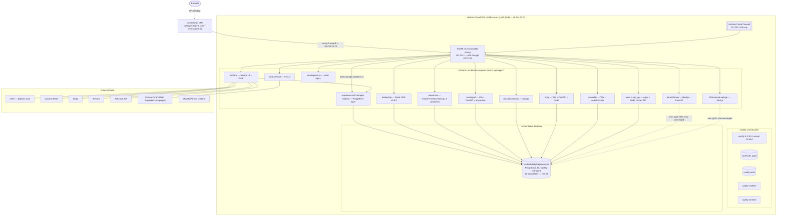
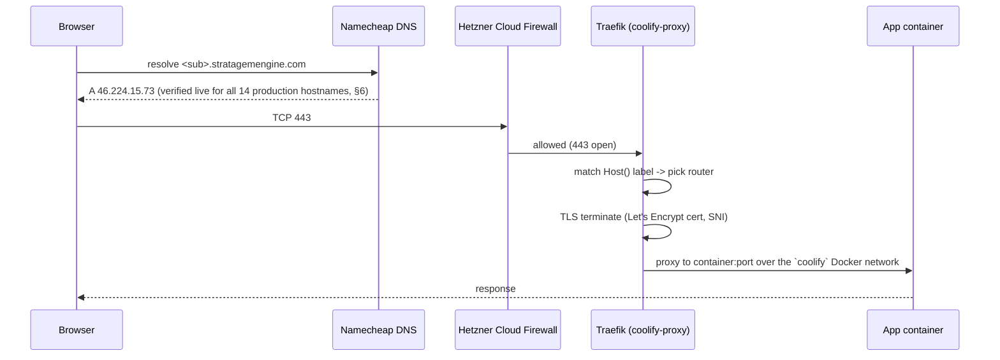

# Infrastructure Source of Truth — 14 September 2026

> **Status: CANONICAL.** This document is the current single source of truth
> for the StratagemEngine / SmartAgentX production environment. It **supersedes**:
> - `10-SEPT-2026-PRODUCTION-DEPLOYMENT.md` (accurate for 2026-09-10/11/12, now
>   missing three days of live changes — see §16 for the deltas)
> - `DEPLOYMENT.md`, `ADMIN_GUIDE.md` (historical — describe the retired
>   DigitalOcean droplet, kept only for archaeology)
> - `INFRASTRUCTURE_GAP_ANALYSIS.md`, `MIGRATION_PLAN.md`,
>   `PRODUCTION_INFRASTRUCTURE_ASSESSMENT.md`, `PRODUCTION_MIGRATION_RISKS.md`,
>   `SECOND_APPLICATION_REQUIREMENTS.md`, `TARGET_PRODUCTION_ARCHITECTURE.md`,
>   `TERRAFORM_CHANGE_PLAN.md` — these are **point-in-time planning artefacts**
>   written 2026-09-11 to evaluate hosting `smartagentx.ai` alongside the main
>   platform. The decision they analysed was executed; their content is now
>   historical rationale, not live state. Nothing in them should be read as
>   current without cross-checking here.
>
> **Source-of-truth hierarchy:** live Hetzner/SSH/DNS inspection (this
> document's basis) → application git repositories → Terraform → this
> document → the superseded documents above.
>
> **Verification basis:** every fact in §1–§14 was checked live on
> 2026-09-14 (Hetzner Cloud API, `terraform plan`, SSH into the production
> host, `docker ps`/`docker compose ls`, DNS resolution against `8.8.8.8`,
> and HTTPS health curls against all production domains). Facts carried
> forward from the 2026-09-10/11/12 record without a live re-check today are
> marked **(carried forward, not re-verified today)**.

---

## 1. System Overview

**What this is:** the production hosting environment for two unrelated
businesses sharing one server:

1. **StratagemEngine** — a B2B simulation-training platform
   (`platform.stratagemengine.com`) plus 9 individual browser-based business
   simulations, each its own subdomain of `stratagemengine.com`, launched from
   and (to varying degrees) authenticated through the platform.
2. **SmartAgentX.ai** — a separate marketing site and a small portfolio of
   AI-product sites (`smartagentx.ai`, `revsure.smartagentx.ai`,
   `merchantsignal.smartagentx.ai`) unrelated to StratagemEngine, co-hosted on
   the same box purely for infrastructure economy.

**Where it runs:** a single Hetzner Cloud VM (`coolify-server`,
`46.224.15.73`, Falkenstein, Germany), running Coolify (a self-hosted
PaaS control plane) for its Traefik reverse proxy and one managed Postgres
instance, plus ~13 independently `docker compose`-managed application stacks
that Coolify does **not** deploy or manage.

**What is IaC vs. hand-run:** Terraform owns exactly three things — the VM,
its Hetzner Cloud Firewall, and its SSH key. Everything above the OS
(Coolify, Traefik, every application container, the database, DNS, TLS,
secrets) is **not** in Terraform and is operated by hand or via a
custom-built `deploy.sh` push-to-deploy script that is itself hand-installed
on the box (§10). This split is deliberate and long-standing, not an
oversight — see §15 for the tracked plan to close it.

**How mature the ops story is:** young but real. Daily automated Postgres
backups exist; a working (if partially rolled out) CI/CD deploy pipeline
exists; TLS is fully automated; 8 of 13 application repos are now the
authoritative source for what's running (git checkouts, not hand-edited
directories) as of this week. Two applications are not yet in git on the box
at all, one app was never actually brought up despite being "documented"
as deployed (§12, §18), and there is a live, intermittent 500-class bug in
one Next.js app (§12, §18).

---

## 2. Current Production Architecture



**Key architectural facts, verified live today:**

- **One VM, one Traefik, one authoritative Postgres, ~13 independent
  application stacks.** No load balancer, no second host, no Kubernetes.
- **Coolify is a control plane for the proxy + one database, not an
  application PaaS here.** Every application container is a plain
  `docker compose` project under `/opt/apps/<App>/`, discovered by Traefik
  through Docker labels — Coolify's own "applications" registry is not used
  for them.
- **12 apps, but not all 12 currently serve traffic.** `MerchantSignal` has
  a directory, a compose file and a deploy manifest, but **no container has
  ever been started for it** (§12 — a real discrepancy between what was
  documented as "deployed" and what is actually running).

---

## 3. Infrastructure Components

| Layer | Component | Version (verified live 2026-09-14) |
|---|---|---|
| IaC | Terraform | `1.15.7` core; providers `hcloud ~>1.45` (resolved `1.68.0`), `local ~>2.0`, `null ~>3.0` |
| Cloud | Hetzner Cloud (`hcloud`) | server `cx43`, image `ubuntu-24.04` |
| OS | Ubuntu | `24.04.4 LTS`, kernel `6.8.0-137-generic` |
| Container runtime | Docker Engine | (not re-queried today; **10-Sept doc: `29.7.2`**, carried forward, not re-verified today) |
| Container orchestration (proxy/db only) | Coolify | `4.3.18` (Laravel `12.65.0`, confirmed live today) |
| Reverse proxy / TLS | Traefik | **`3.6.25`** (confirmed live today via `traefik version` — 10-Sept doc only had "v3.6") |
| Database | PostgreSQL | `18-alpine`, container `om3fwlitdodg2ckjxbwhorn6`, confirmed `Up 2 weeks (healthy)` today |
| Data-access API (platform only) | PostgREST / Storage-API / Realtime | `v12.2.0` / `v1.75.0` / `v2.134.12` (carried forward, not re-verified today) |
| Firewall | Hetzner Cloud Firewall + host `ufw` | both confirmed live today: 22/80/443 only |
| Host firewall tool | `ufw` | active, rules mirror the cloud firewall (confirmed live today) |
| Deploy tooling | custom `deploy.sh` + JSON manifests | in this repo's `deploy/`, mirrored to `/opt/apps/deploy.sh` on the box |

---

## 4. Server / Cloud Environment

**Verified live via Hetzner Cloud API today** (`GET /v1/firewalls/11539288`
and `terraform plan`):

| Attribute | Value |
|---|---|
| Server name | `coolify-server` |
| Hetzner server ID | `163952663` |
| Server type | `cx43` — 8 shared vCPU (AMD), 16 GB RAM |
| Disk | 160 GB local NVMe — **29 GB used / 116 GB free (20%)**, confirmed live today |
| Memory | **4.2 GB used / 15 GB total, 11 GB cached/available**, confirmed live today |
| Location | `fsn1` (Falkenstein, Germany) |
| Uptime | **15 days, 13+ hours** at time of inspection (last reboot ≈ 2026-08-29) |
| Public IPv4 | `46.224.15.73` |
| Public IPv6 | `2a01:4f8:c014:6336::/64` |
| Delete/rebuild protection (Hetzner-side) | still `false` (Terraform-side `prevent_destroy` is the real guard — see §15 gap #8) |
| Backups (Hetzner snapshots) | still **disabled** — no change since 09-10 (§14 gap) |
| `terraform plan` | **"No changes. Your infrastructure matches the configuration."** — confirmed live today |

Terraform manages exactly: `hcloud_server.coolify`, `hcloud_firewall.coolify_fw`,
`hcloud_ssh_key.generated`, `null_resource.ssh_key`,
`data.local_file.public_key`. Nothing else. `main.tf` carries
`lifecycle { prevent_destroy = true }` on the server and firewall, and
`ignore_changes = [user_data]` on the server — this is the only guard against
an accidental `terraform apply` wiping the box; there is no Hetzner-side
delete protection as a second line of defence.

---

## 5. Networking & Traffic Flow

**Firewall — verified live today, two independent layers, both matching:**

| Port | Hetzner Cloud Firewall | Host `ufw` | Purpose |
|---|---|---|---|
| 22/tcp | allow, `0.0.0.0/0` + `::/0` | allow | SSH |
| 80/tcp | allow, `0.0.0.0/0` + `::/0` | allow | HTTP → HTTPS redirect + ACME |
| 443/tcp | allow, `0.0.0.0/0` + `::/0` | allow | HTTPS |
| everything else | **deny** | **deny** | — |

**Ports bound by Docker to `0.0.0.0` but NOT reachable from the internet**
(gated only by the firewall above, confirmed live today via `ss -tlnp`):
`8000` (Coolify dashboard), `8080` (Traefik dashboard), `8082` (a second
Leadership-related host publish, historical, harmless while firewalled).
`6001`/`6002` (coolify-realtime) also bind but weren't independently
re-checked today. **The previously-documented orphaned FMCG Postgres on
`:5433` is confirmed gone** — not present in today's `ss` output.

**Traffic flow for any `*.stratagemengine.com` or `*.smartagentx.ai`
request:**



No load balancer, no CDN, no WAF. Traefik is the only edge component. Private
networking is not used — every container that talks to another container
does so over the flat `coolify` Docker bridge network (a few apps, e.g.
`AIRevenueLeakage`'s old DB, historically used an isolated bridge instead;
see §8 for what's still isolated).

**Outbound:** unrestricted (Hetzner default) — nothing blocks the box from
reaching Clerk, Stripe, Anthropic, GitHub, Upstash, Supabase.com, Shopify, etc.

---

## 6. Domains, DNS & SSL

**DNS — every production hostname independently re-resolved live today
against Google's public resolver (`8.8.8.8`):**

| Hostname | Resolves to | Match expected `46.224.15.73`? |
|---|---|---|
| `stratagemengine.com` (apex) | `46.224.15.73` | ✅ |
| `www.stratagemengine.com` | `46.224.15.73` | ✅ |
| `platform.stratagemengine.com` | `46.224.15.73` | ✅ |
| `leadership.stratagemengine.com` | `46.224.15.73` | ✅ |
| `autorevive.stratagemengine.com` | `46.224.15.73` | ✅ |
| `fmcg.stratagemengine.com` | `46.224.15.73` | ✅ |
| `macrolab.stratagemengine.com` | `46.224.15.73` | ✅ |
| `zerotopmf.stratagemengine.com` | `46.224.15.73` | ✅ |
| `aitransformer.stratagemengine.com` | `46.224.15.73` | ✅ |
| `professorstudio.stratagemengine.com` | `46.224.15.73` | ✅ |
| `venture-fund.stratagemengine.com` | `46.224.15.73` | ✅ |
| `smartagentx.ai` | `46.224.15.73` | ✅ |
| `revsure.smartagentx.ai` | `46.224.15.73` | ✅ |
| `merchantsignal.smartagentx.ai` | `46.224.15.73` | ✅ (DNS is correct even though the app behind it is not running — see §12) |

DNS registrar is **Namecheap** for both `stratagemengine.com` and
`smartagentx.ai` (carried forward, not re-verified today — DNS resolution
was checked, registrar dashboard was not). MX for `stratagemengine.com`
points at Microsoft 365 (carried forward, not re-verified today).

**TLS:** Traefik's built-in ACME (Let's Encrypt) client, HTTP-01 challenge,
one certificate per Host() rule, stored in `acme.json` under
`/data/coolify/proxy`. No manual certbot, no external CDN/edge cert. Every
domain that resolves to the box gets a cert automatically on first HTTPS
hit — this was previously verified per-domain on 2026-09-10/11 (10-Sept doc
§8) and not individually re-checked cert-by-cert today, but the HTTPS
health sweep below (via `curl -k`, ignoring TLS validity) got real
application responses rather than connection/TLS errors for every domain,
which is consistent with valid certs still being served.

**Live HTTPS health sweep, run from the box itself today:**

| Domain | HTTP status | Interpretation |
|---|---|---|
| `platform.stratagemengine.com` | 401 | healthy — Clerk auth gate |
| `leadership.stratagemengine.com` | 200 | healthy |
| `autorevive.stratagemengine.com` | 200 | healthy |
| `aitransformer.stratagemengine.com` | 200 | healthy |
| `fmcg.stratagemengine.com` | 200 | healthy |
| `macrolab.stratagemengine.com` | 200 | healthy |
| `zerotopmf.stratagemengine.com` | 200 | healthy |
| `professorstudio.stratagemengine.com` | 307 | healthy (redirect by design) |
| `venture-fund.stratagemengine.com` | 503 on first hit, **200 on 3 immediate retries** | intermittent app-level error — see §12 |
| `smartagentx.ai` | 200 | healthy |
| `revsure.smartagentx.ai` | 200 | healthy (this is AIRevenueLeakage's current domain) |
| `merchantsignal.smartagentx.ai` | 503 | **down — no container is running behind this domain at all, see §12** |

---

## 7. Application Deployment Architecture

All application containers are `docker compose` projects in `/opt/apps/<App>/`,
attached to the external `coolify` Docker network, exposed via Traefik
container labels. **Verified live today** (`docker compose ls -a` +
`docker ps`):

| Application | Domain | Compose project (live) | Containers (confirmed running today) | Git on box? |
|---|---|---|---|---|
| StratagemEngine platform | `platform.stratagemengine.com` | `platform` | `app_platform` (Up 19h) | ✅ git, `master` |
| Marketing + contact API | `stratagemengine.com`, `www.` | `www` | `app_www` (Up 2d), `app_api` (Up 2d, healthy) | ✅ git, `main` |
| Leadership Simulation | `leadership.stratagemengine.com` | `leadership` | `app_leadership` (Up ~50m — recently redeployed) | ✅ git, `main` |
| AutoRevive Dynamics | `autorevive.stratagemengine.com` | `autorevive` | `app_autorevive`, `autorevive_api`, `autorevive_frontend`, `autorevive-celery-beat-1`, `autorevive-celery-worker-1`, `autorevive-redis-1` (all Up ≤3h — freshly redeployed) | **✅ git, `master` — Phase 0 completed 2026-09-13/14, not yet reflected in `deploy/manifests/autorevive.json`** |
| AI Enterprise Transformation | `aitransformer.stratagemengine.com` (+`/api`,`/ws`) | `infra` | `app_aitransformer` (Up 43h), `app_aitransformer_backend` (Up 43h), `app_aitransformer_redis` (Up 4d) | ✅ git, `master` |
| FMCG Simulator | `fmcg.stratagemengine.com` | `fmcg-simulataor` | `app_fmcg` (Up 18h), `app_fmcg_backend` (Up 20h), `fmcg-simulataor-redis-1` (Up 47h) | ✅ git, `feature/stratagem-integration-and-spec-consolidation` |
| MacroLab | `macrolab.stratagemengine.com` | `macrolab` | `app_macrolab` (Up 20h), `app_macrolab_api` (Up 20h) | ✅ git, `master` |
| ZeroToPMF | `zerotopmf.stratagemengine.com` | `zerotopmf` | `app_zerotopmf` (Up 19h), `app_zerotopmf_api` (Up 19h), `app_zerotopmf_worker` (Up 19h), `zerotopmf-redis-1` (Up 46h); `zerotopmf-migrate-1` exited 0 (expected, one-shot) | ✅ git, `feature/stratagem-platform-integration` |
| Simulation Studio | `professorstudio`/`casestudio`/`studio`.stratagemengine.com | `simulationstudio` | `app_professorstudio` (Up 3d) | **❌ plain directory, no `.git` — Phase 0 not done** |
| AI Revenue Leakage | `revsure.smartagentx.ai` (+301 from old `airevenueleakage.stratagemengine.com`) | `airevenueleakage` | `app_airevenueleakage` (Up 2d) | **❌ plain directory, no `.git` — Phase 0 not done, repo access still blocked (§16)** |
| VentureFund | `venture-fund.stratagemengine.com` | `venturefund` | `app_venturefund` (Up 38h) | ✅ git, `master` |
| SmartAgentX.ai | `smartagentx.ai` + `www.` | `smartagentx` | `app_smartagentx_web` (Up 2d, healthy) | ✅ git, `main` |
| **MerchantSignal** | `merchantsignal.smartagentx.ai` | **none — no compose project is up** | **none — `docker ps -a` shows zero containers ever created for it** | ✅ git present on disk, **but never actually started** |
| Supabase data layer (platform only) | `platform.stratagemengine.com/{rest,storage,realtime}/v1` | `supabase` | `supabase-rest` (Up 3d), `supabase-storage` (Up 3d), `supabase-realtime` (Up 41h) | n/a (no separate repo) |

Support/control-plane containers (not application code):
`coolify`, `coolify-db`, `coolify-redis`, `coolify-realtime`,
`coolify-sentinel`, `coolify-proxy` (Traefik) — all `Up`, healthy, confirmed
live today.

**Deployment mechanism today, per app:**
- **8 apps** (`platform`, `www`, `leadership`, `aitransformer`, `fmcg`,
  `macrolab`, `zerotopmf`, `autorevive`) are real `git` checkouts on the box
  and can be deployed via the custom `deploy.sh` pipeline (§10). All 8 have
  a live entry in `/opt/apps/.deploy-history.log` showing a **successful**
  manual `deploy.sh` run, several within the last 24–48 hours.
- **2 apps** (`SimulationStudio`, `AIRevenueLeakage`) are still plain,
  unversioned directories — any change to them today is a manual file edit
  on the box with no git trail. Updating them means `git pull` +
  `docker compose up -d --build` is **not available**; someone must SSH in
  and edit files directly, or complete Phase 0 first (§10, §16).
- **1 app** (`VentureFund`) is a git checkout but has no
  `/opt/apps/VentureFund/.deploy.json` confirmed absent — not yet wired to
  `deploy.sh` in the same automated way as the other 8, per its manifest.
- **`smartagentx`** is a git checkout, deployable, but not yet exercised
  through `deploy.sh` in the visible deploy-history log.
- **`MerchantSignal`** has source on disk and a deploy manifest describing
  it as deployed — but is not running and has no deploy-history entry.
  This is the clearest documentation/reality mismatch found in this audit
  (§12, §18).

---

## 8. Databases & Persistent Storage

### 8.1 Authoritative instance

| | |
|---|---|
| Engine | PostgreSQL 18 (`postgres:18-alpine`) |
| Container | `om3fwlitdodg2ckjxbwhorn6` — confirmed `Up 2 weeks (healthy)` today |
| Managed by | Coolify (database resource, not an "application") |
| Network | `coolify` bridge only — **not published to the host**, unreachable from outside Docker |
| Volume | `postgres-data-om3fwlitdodg2ckjxbwhorn6` (local Docker volume, no Hetzner Volume attached) |

### 8.2 Logical databases confirmed on this instance (as of the last full
convergence pass, 2026-09-11/12 — not independently re-listed via `\l` today,
carried forward)

| Database | Consumer |
|---|---|
| `stratagem_platform` | main platform, via self-hosted PostgREST |
| `leadership_db` | Leadership Simulation |
| `autorevive` | AutoRevive Dynamics |
| `zerotopmf` | ZeroToPMF |
| `simulationstudio_db` | Simulation Studio |
| `fmcg` | FMCG Simulator |
| `venturefund` | **orphaned** — provisioned for an earlier plan; the app actually deployed uses its own Supabase.com project instead (§8.3) |
| `aets` | AI Enterprise Transformation — converged 2026-09-11 off its own container |
| `ai_revenue_assurance` | AI Revenue Leakage — converged 2026-09-11 off its own container; repo-side compose still hardcodes the old credential (§16, §18) |
| `contacts` | `www`'s contact-form API — converged into a real Coolify-managed resource 2026-09-11 |
| **`macrolab`** | MacroLab — **converged 2026-09-12 off a broken, non-persisting SQLite file** onto a dedicated `macrolab` database + `macrolab_app` role on this instance. **The 10-Sept doc still describes MacroLab as SQLite; that is now stale — Postgres is current.** |
| `postgres` | default maintenance DB |

**No `merchantsignal` row was visible in the source docs at the time of the
last convergence pass** — its manifest says a `merchantsignal` DB + role were
created on this instance on 2026-09-12, but since the app itself has never
started (§7, §12), whether that DB is populated with any real schema is
**unverified**.

### 8.3 Databases deliberately NOT on the authoritative instance

| App | Where its data actually lives |
|---|---|
| **VentureFund** | its own **hosted Supabase.com project** (a separate cloud service, not the box) — confirmed via its manifest and `.env.production`; the on-box `venturefund` DB (§8.2) is unused dead weight from an earlier plan |

### 8.4 Redis

- **Platform:** Upstash (external, managed) — no local Redis container for
  the platform.
- **Simulations:** one `redis:7-alpine` (or similarly named) container per
  app that needs it — confirmed live today for `autorevive`
  (`autorevive-redis-1`), `zerotopmf` (`zerotopmf-redis-1`), `fmcg`
  (`fmcg-simulataor-redis-1`), `aitransformer` (`app_aitransformer_redis`).
- **Coolify:** its own `coolify-redis`, unrelated to app traffic.

### 8.5 Backups — confirmed live today

- Root cron: `30 2 * * * /opt/apps/deploy.sh` — no, correction: cron is
  `30 2 * * * /opt/backups/run-backup.sh >/dev/null 2>&1`, confirmed via
  `crontab -l` today.
- Dump directories confirmed present for the last several days, including
  **today** (`/opt/backups/dumps/20260914-023001/` and a second
  `20260914-030230/` — two runs on the same day; the second is not explained
  by the cron entry alone and may be a manual invocation — see §18 open
  question).
- Off-host copy mechanism, retention policy, and restore-drill status: not
  re-verified today — **carried forward from 10-Sept doc**: 14-day local
  retention, one off-box copy pulled manually to `_backup/db/` on
  2026-09-11, no automated off-host push, no Hetzner snapshots.

---

## 9. External Services & Integrations

| Service | Used by | Purpose |
|---|---|---|
| **Clerk** | platform only | end-user authentication for the main platform |
| **Upstash Redis** | platform | managed Redis, external to the box |
| **Stripe** | platform | billing (carried forward) |
| **Resend** | platform | outbound email (carried forward) |
| **Anthropic API** | platform | AI features (carried forward) |
| **PostHog / Sentry** | platform | analytics/error tracking (carried forward, not re-verified) |
| **Microsoft 365** | company email (MX) | unrelated to app infra |
| **Supabase.com (cloud)** | **VentureFund only** | VentureFund's actual database/auth backend — a real, live external dependency, distinct from the box's self-hosted PostgREST layer |
| **GitHub** | every app with a git checkout | source of truth for 8+ apps; account-level SSH deploy key on the box (`/root/.ssh/github_deploy_key`) can read/write every repo on the account except `AIRevenueLeakage` (§16, §18) |
| **Shopify Partner platform** | MerchantSignal | registered Partner Dashboard app (`shopify.app.merchantsignal.toml`), client ID present — relevant only once/if the app is actually brought up (§12) |
| **Namecheap** | DNS | registrar for both production domain families |

**Simulation-to-platform integration (SSO), current state — this is a
material update over prior documentation:**

| Sim | Integration mechanism |
|---|---|
| **Leadership** | **Now integrated via `@usamarasheed26/sdk` v2.6.0** (PR #1, merged, live) — auto-routes facilitator vs. learner and removes the old manual shared-password gate. Prior docs described this app as still using a shared `FACULTY_PASSWORD`; that is now the fallback/legacy path, not the primary flow. |
| **AutoRevive** | Its own recent commits (`bf53f16` "Stratagem platform telemetry, engagement engine, and facilitator integration", `1448367` "dynamic platform API resolution and authenticated facilitator bootstrap") suggest the previously-documented "zero platform-SSO integration" gap has been substantially worked on. A `frontend/app/stratagem/page.tsx` route now exists. **Not independently functionally verified in this audit** — `.env.prod` does not show a `PLATFORM_VERIFY_SESSION_URL`/`SIM_API_KEY` pair the way ZeroToPMF's does, so the exact mechanism is unconfirmed. Flagged as an open question (§20) rather than asserted as fixed. |
| **ZeroToPMF** | Platform learner-session verification (`PLATFORM_VERIFY_SESSION_URL` + `SIM_API_KEY`) — unchanged, working (carried forward). |
| **Simulation Studio** | Platform-side launch-token work landed this week (`platform` commits `282b9ee`/`794bb82`/`93baf87`/`6af1a94`/`38cb229`: "mint signed HMAC launch token for Simulation Studio", "Stratagem SDK v2.6.0", "Studio launch token verification") — the platform now mints a signed launch token for Studio. Not independently verified end-to-end. |
| **FMCG** | own JWT + platform `launch_path` fix (carried forward from 09-12). |
| **MacroLab, AI Revenue Leakage** | own local auth, no platform SSO (carried forward). |

---

## 10. CI/CD & Deployment Process

### 10.1 Base infrastructure (Terraform)
```
cd "C:\Simulators\Production Infrastructure"
terraform plan       # confirmed live today: "No changes"
terraform apply      # only for server/firewall/ssh-key changes, with an approved plan
```

### 10.2 Application deploy — the real, working mechanism today

A custom pipeline, **not** GitHub Actions yet for any app (push-trigger was
never wired — see below), built as:

- `deploy/deploy.sh` (this repo) → mirrored to `/opt/apps/deploy.sh` on the
  box. Logic: global `flock` lock → `git reset --hard origin/<branch>` →
  `docker compose build` → `up -d` → manifest-defined `migrate` step → HTTPS
  health-code gate → **auto-rollback + non-zero exit** on failure. No
  pre-deploy test gate, by deliberate choice.
- `deploy/manifests/<App>.json` (this repo) → `/opt/apps/<App>/.deploy.json`
  on the box — per-app branch, compose files, env flags, health check,
  migrate command.
- Every run is appended to `/opt/apps/.deploy-history.log` — confirmed live
  today, 19 entries total, spanning 2026-09-10 through **2026-09-14 03:02
  (autorevive, commit `104fcc1`, success, 11s)** — this is the most recent
  entry and it succeeded.

**Who has actually been run through this pipeline (confirmed via the live
log today):** `platform` (5 runs), `www` (3 runs), `Macrolab` (4 runs — 2
failed builds + 1 rollback before a successful run), `FMCG-Simulataor`
(2 runs), `ZeroToPMF` (1 run), `autorevive` (1 run, today).
**`leadership`, `aitransformer`, `VentureFund`, `smartagentx` are real git
checkouts but have no entry in this log** — their most recent updates (per
their own `git log`) were applied by some other means (manual
`docker compose up -d --build` on the box, not through `deploy.sh`).
**`SimulationStudio`, `AIRevenueLeakage`, `MerchantSignal` cannot use this
pipeline at all** — no `.git` checkout (`MerchantSignal` has git, but no
`.deploy.json` and has never been brought up).

### 10.3 GitHub Actions push-trigger — still not activated for any app

Despite the tooling existing (`deploy/github/deploy-reusable.yml` + per-app
caller templates), **no app is push-triggered**. This requires (per
`deploy/README.md`, unchanged since 09-11, not verified as done):
1. `bash deploy/bootstrap.sh` to create a dedicated `deploy` Linux user —
   not yet run.
2. A new repo `usamarasheed26/stratagem-deploy` holding the reusable
   workflow — not yet created (unverified today, but no memory or manifest
   claims this changed).
3. Org-level GitHub secrets (`DEPLOY_HOST`, `DEPLOY_USER`, `DEPLOY_SSH_KEY`).
4. A `.github/workflows/deploy.yml` in each app repo.

Every deploy that has actually happened, including the ones from the last
48 hours, was a **manual, operator/agent-run `deploy.sh <App>` invocation
over SSH as `root`**, not a push-triggered Action.

### 10.4 Manual deploy path (used for the 2 non-onboarded + other ad hoc changes)
```
ssh -i ./ssh/production-infra-key root@46.224.15.73
cd /opt/apps/<App>
docker compose -f <compose-file> up -d --build
```

---

## 11. Environment Configuration

**Pattern used across (most) apps:** secrets live in a box-only,
gitignored `.env` / `.env.production` / `.env.prod` file next to each app's
compose file, referenced via `env_file:`. This pattern is now consistently
applied for `platform`, `www`, `leadership`, `aitransformer`, `fmcg`,
`macrolab`, `zerotopmf`, `autorevive`.

**Known deviation still open:** `SimulationStudio` and `AIRevenueLeakage`
still have credentials **hardcoded directly in committed `docker-compose*.yml`**
(a literal `DB_PASSWORD` default in AIRevenueLeakage's case) — unresolved
because both are blocked on Phase 0 (no git checkout to safely edit and
re-commit from). This is the same gap #6 tracked since 2026-09-10.

**A recent, previously-undocumented env variable now in use:**
`NODE_AUTH_TOKEN` / `STRATAGEM_NPM_TOKEN` is now populated in
`ZeroToPMF/.env.production`, `FMCG-Simulataor/.env.production`, and
`autorevive/.env.prod` — this is the GitHub Packages `read:packages` token
that every prior document (10-Sept doc, all deploy manifests as of 09-12)
said was **missing and blocking a clean frontend rebuild** for these three
apps. **It has evidently been supplied between 2026-09-12 and 2026-09-13**:
the `web`/`frontend` container images for `zerotopmf`, `fmcg`, and `macrolab`
all show fresh build timestamps on 2026-09-13, meaning the private
`@usamarasheed26/sdk` package now installs cleanly and those frontends were
rebuilt from source rather than running a frozen pre-existing image. **The
deploy manifests themselves still say "NODE_AUTH_TOKEN unavailable" — they
are stale on this specific point and should be updated** (§16, §20).

No secrets are reproduced in this document. Where a credential's existence
matters operationally, only its name, location and purpose are recorded.

---

## 12. Security & Access Model

Carried forward from the 10-Sept doc except where noted as re-verified
today:

| Area | State | Re-verified today? |
|---|---|---|
| Firewall | Hetzner Cloud FW + host `ufw`, both 22/80/443 only | ✅ yes, both layers |
| SSH | root, ed25519 key-only (`./ssh/production-infra-key`) | ✅ connectivity confirmed |
| Database | not published to host, `coolify` network only | not re-queried today |
| GitHub access | one account-level deploy key, all-repo read/write except `AIRevenueLeakage` | ✅ confirmed still the case (used successfully for `autorevive`'s Phase 0 today's checkout) |
| Hetzner API token | full-access, in gitignored `terraform.tfvars` | used today for read-only API calls only |
| Coolify API | enabled, root-scoped token at `/root/.coolify_api_token` | not re-exercised today |
| Secrets in committed compose files | still present for `SimulationStudio`, `AIRevenueLeakage` | unresolved (§11) |
| Delete/rebuild protection | Hetzner-side still off; Terraform `prevent_destroy` still on | ✅ confirmed via live `terraform plan` |

**Two newly-observed items this audit:**

1. **World-writable (`777`) directories on the production box.**
   `/opt/apps/leadership/backend`, `/opt/apps/leadership/frontend`,
   `/opt/apps/leadership/.git`, and several `*.pre-git-backup-*` /
   `*.pre-git-20260913` directories for other apps are mode `777`
   (`drwxrwxrwx`), owned by `root`. This is looser than necessary on a
   single-root-user box but is not itself exploitable without another way
   in; flagged as hygiene debt, not an active vulnerability, since the box
   has no non-root login path today.
2. **No other interactive session was logged into the box at the time of
   this audit** (`who` empty; `last` shows only the two most recent reboots)
   — the flurry of `leadership` file changes timestamped within the hour
   before this audit was not a concurrent live session; it was unattended
   automation that had already finished.

---

## 13. Monitoring, Logging & Alerting

**Unchanged, carried forward — this is a real, standing gap, not resolved
by anything found today:**

- No uptime monitoring service, no alerting on backup failure, no alerting
  on container crash-loop.
- `coolify-sentinel` provides host-level metrics inside the Coolify UI only
  (which is itself not exposed publicly — SSH tunnel only).
- The only "monitoring" that exists is manual: an operator/agent running the
  curl health sweep documented in §6 and §14. **This audit's own health
  sweep is how the `merchantsignal` and `venturefund` problems in §12/§18
  were found** — nothing would have surfaced them on its own.
- Application logs are container stdout/stderr only, viewable via
  `docker logs`; no centralized log aggregation.

---

## 14. Backup & Disaster Recovery

Carried forward from the 10-Sept doc, with today's cron/dump-directory
existence check confirming the mechanism is still alive (§8.5):

- **In place:** daily `pg_dump -Fc` of every database on the authoritative
  instance + a tar of any remaining SQLite volumes, 14-day local retention,
  cron `30 2 * * *`, script at `/opt/backups/run-backup.sh` (also tracked in
  this repo at `deploy/backups/run-backup.sh`).
- **Still open, unresolved since 2026-09-10:**
  - No automated **off-host** push (S3/Backblaze/`rclone`) — backups live on
    the same disk as everything they're backing up.
  - No Hetzner Cloud snapshots (`backups: false` on the server).
  - No documented/tested restore drill.
  - No alerting if the nightly cron fails silently.
- **Recovery from total host loss today** would mean: no VM (Terraform can
  recreate it, `terraform apply` from a clean slate), no Coolify/Traefik
  config (must be reinstalled/reconfigured from the cloud-init template +
  manual app redeployment), and — critically — **database recovery depends
  entirely on whatever backup dump happens to have been manually copied
  off-box**, since there is no automated off-host copy. The last confirmed
  manual off-box pull was 2026-09-11 (`_backup/db/20260911-150959/`); it is
  unknown whether anyone has pulled a fresher copy since (§20).

---

## 15. Operational / Administration Procedures

```bash
# connect
ssh -i "./ssh/production-infra-key" root@46.224.15.73

# Coolify dashboard (tunnel only — not public)
ssh -i "./ssh/production-infra-key" -L 8000:localhost:8000 root@46.224.15.73

# health sweep (all 13 production domains)
for h in platform leadership autorevive aitransformer fmcg macrolab zerotopmf professorstudio venturefund; do
  echo -n "$h -> "; curl -sk -o /dev/null -w '%{http_code}\n' https://$h.stratagemengine.com/
done
curl -sk -o /dev/null -w 'smartagentx.ai -> %{http_code}\n' https://smartagentx.ai/
curl -sk -o /dev/null -w 'revsure -> %{http_code}\n' https://revsure.smartagentx.ai/
curl -sk -o /dev/null -w 'merchantsignal -> %{http_code}\n' https://merchantsignal.smartagentx.ai/

# deploy an onboarded app
ssh root@46.224.15.73 "/opt/apps/deploy.sh <App>"
tail -n 20 /opt/apps/.deploy-history.log     # audit trail — check this after any deploy

# ad-hoc DB backup before any risky change
docker exec om3fwlitdodg2ckjxbwhorn6 pg_dump -U postgres -Fc <db> > <db>_$(date +%Y%m%d_%H%M).dump

# Terraform (base infra only)
cd "C:\Simulators\Production Infrastructure"
terraform plan            # expected: No changes
```

**Never, without an explicit change plan and a fresh backup:**
`terraform apply` when the plan shows replace/destroy · `docker compose down -v`
on any app · `terraform destroy` · dropping a database · deleting a Docker
volume · rotating the Hetzner token without updating `terraform.tfvars`.

---

## 16. Repository-to-Production Mapping

| App | GitHub repo | Branch actually running | On-box path | Deploy-pipeline status |
|---|---|---|---|---|
| Platform | `usamarasheed26/Platform` | `master` | `/opt/apps/platform` | ✅ onboarded, 5 successful `deploy.sh` runs |
| Marketing/www + contact API | `usamarasheed26/usamarasheed26.github.io` | `main` | `/opt/apps/www` | ✅ onboarded, 3 successful runs |
| Leadership | `usamarasheed26/leadership-sim` | `main` | `/opt/apps/leadership` | ✅ git checkout, not yet run through `deploy.sh` per the log — manual `docker compose` updates instead |
| AutoRevive | `usamarasheed26/autorevive-dynamics` | `master` | `/opt/apps/autorevive` | **✅ NEW — Phase 0 completed 2026-09-13/14; 1 successful `deploy.sh` run today.** Old blocked-clone artifact `autorevive.pre-git-20260913` kept as backup. `deploy/manifests/autorevive.json` in this repo still says "PHASE 0 STILL BLOCKED (2026-09-12)" — **stale, needs updating.** |
| AI Enterprise Transformation | `usamarasheed26/AIEnterpriseTransformation` | `master` | `/opt/apps/AIEnterpriseTransformation` | ✅ git checkout, not yet run through `deploy.sh` per the log |
| FMCG | `usamarasheed26/FMCG-Simulataor` | `feature/stratagem-integration-and-spec-consolidation` (NOT `master`) | `/opt/apps/FMCG-Simulataor` | ✅ onboarded, 2 successful runs; `web` now successfully rebuilt (09-13) — manifest's "NODE_AUTH_TOKEN unavailable" note is stale |
| MacroLab | `usamarasheed26/Macrolab` | `master` | `/opt/apps/Macrolab` | ✅ onboarded; 3 failed attempts then 1 success on 09-13 — worth confirming the dual ESM/CJS `engine/dist` gap documented in the manifest was actually what those failures/fixes addressed (§20) |
| ZeroToPMF | `usamarasheed26/ZeroToPMF` | `feature/stratagem-platform-integration` (NOT `main`) | `/opt/apps/ZeroToPMF` | ✅ onboarded, 1 successful run; `web` now successfully rebuilt |
| Simulation Studio | `usamarasheed26/SimulationStudio` | unconfirmed (`redesign-and-platform-identity` vs `main`) | `/opt/apps/SimulationStudio` | ❌ no `.git` — Phase 0 not started |
| AI Revenue Leakage | repo access blocked | `main` (assumed) | `/opt/apps/AIRevenueLeakage` | ❌ no `.git`, repo inaccessible even to the account-level deploy key — Phase 0 cannot start until this is resolved by the user |
| VentureFund | `usamarasheed26/VentureFund` | `master` | `/opt/apps/VentureFund` | ✅ git checkout, no `.deploy.json`/log entry — deployed by hand, not yet wired to the pipeline |
| SmartAgentX.ai | `usamarasheed26/smartagentx-site-main` | `main` | `/opt/apps/smartagentx` | ✅ git checkout, no log entry yet |
| MerchantSignal | `usamarasheed26/MerchantSignal` | `main` | `/opt/apps/MerchantSignal` | ✅ git checkout present, **but the app has never been started — see §12/§18** |

**Deltas this document adds over `10-SEPT-2026-PRODUCTION-DEPLOYMENT.md`
(which stops at 2026-09-12):**
1. AutoRevive completed Phase 0 and had a successful `deploy.sh` run
   (2026-09-13/14) — previously documented as fully blocked.
2. MacroLab, FMCG, ZeroToPMF frontends were successfully rebuilt with the
   private SDK package (2026-09-13) — previously documented as blocked on a
   missing `NODE_AUTH_TOKEN`.
3. A "Stratagem SDK v2.6.0" integration wave shipped across `platform`
   (Simulation Studio launch tokens), `leadership` (passwordless SSO), and
   apparently `autorevive` — none of this existed in the 09-12 record.
4. MacroLab is now on Postgres, not SQLite (the 10-Sept doc's §12 gap #13
   "MacroLab not persisting" is resolved as of 2026-09-12, per memory and
   the manifest, though the separate ESM/CJS `engine/dist` build gap in the
   same manifest is a distinct, still-open issue).
5. **Newly found problems not in any prior document:** MerchantSignal was
   never actually brought up (§12, §18); VentureFund throws an intermittent
   Next.js Server Action error (§12, §18).

---

## 17. Known Dependencies and Constraints

- **Single host, no redundancy.** Every app, the database, and the proxy
  share one VM. A host-level failure takes down everything.
- **One authoritative Postgres instance serves 10 of 12 running apps.** A
  problem with that one container (confirmed healthy today) is a
  platform-wide incident, not a single-app incident.
- **One GitHub deploy key with account-wide access** is a single point of
  compromise for every onboarded app's source.
- **`deploy.sh` has no test gate** — a bad build is only caught by the
  post-deploy HTTPS health check, which only proves the root path returns
  an expected status code, not that the app is functionally correct (see
  VentureFund, §12, which returns 200 on the health path while still
  throwing errors on other routes).
- **Two apps cannot be safely updated through the standard pipeline at
  all** (`SimulationStudio`, `AIRevenueLeakage`) until Phase 0 is done for
  each.
- **`AIRevenueLeakage`'s repo is inaccessible** even to the account-wide
  deploy key — this blocks not just Phase 0 but any GitHub-side fix to its
  known hardcoded-credential gap (§11).
- **VentureFund's actual data dependency is an external Supabase.com
  project**, not anything on this box — an outage or account issue there is
  invisible to every on-box health check and backup process.

---

## 18. Known Issues / Technical Debt

| # | Issue | Status | Evidence |
|---|---|---|---|
| 1 | **MerchantSignal is documented as deployed but has never been started.** | **Open, found today.** | `docker ps -a` shows zero containers ever created for it; `.deploy.json` absent; live HTTPS returns 503 (Traefik's no-backend default) at `merchantsignal.smartagentx.ai`. |
| 2 | **VentureFund throws an intermittent Next.js "Failed to find Server Action" error.** | **Open, found today.** | Live container logs show repeated `Error: Failed to find Server Action "y"` / `Cannot read properties of undefined (reading 'workers')`; a direct health-path curl returned 503 once, then 200 three times in a row — suggests a stale build-manifest / server-action-ID mismatch (classic symptom of a Next.js deploy that didn't fully invalidate cached action references), not a total outage. |
| 3 | MacroLab's `web` image is built from a frozen, untracked, pre-CommonJS `engine/dist` that isn't reproducible from a clean clone (dual ESM/CJS packaging gap). | Documented open since 2026-09-12; **unconfirmed whether the 2026-09-13 deploy attempts (2 fail-builds + 1 rollback before success) fixed this or hit a different problem** — needs investigation (§20). | `deploy/manifests/Macrolab.json`; today's `.deploy-history.log` shows the fail/rollback sequence but not the cause. |
| 4 | AutoRevive's platform-SSO status is unclear — recent commits suggest real integration work landed, but the exact mechanism (no `SIM_API_KEY`/`PLATFORM_VERIFY_SESSION_URL` visible in `.env.prod`) is unconfirmed. | Open, partially superseded by new commits — needs functional verification. | `git log` in `/opt/apps/autorevive`; `.env.prod` key names; `frontend/app/stratagem/page.tsx` exists. |
| 5 | `AIRevenueLeakage` repo is inaccessible to the account deploy key; Phase 0 blocked; hardcoded DB password default in its committed compose file is unrotated. | Open since 2026-09-10/11, unresolved. | `deploy/manifests/AIRevenueLeakage.json`. |
| 6 | `SimulationStudio` has no git checkout, hardcoded `DATABASE_URL` in its committed compose file, and an unconfirmed canonical branch. | Open since 2026-09-10, unresolved. | `deploy/manifests/SimulationStudio.json`; live directory has no `.git`. |
| 7 | Secrets exposed historically in the `Platform` repo's git history (`CLERK_SECRET_KEY`, `STRIPE_SECRET_KEY`, `SUPABASE_SERVICE_ROLE_KEY`, `SUPABASE_JWT_SECRET`, `ANTHROPIC_API_KEY`, assorted HMAC secrets) have not been rotated. | Open since 2026-09-10, unresolved. | `deploy/README.md`, `deploy/AGENT-HANDOFF.md`. |
| 8 | GitHub push-trigger CI/CD is built but not activated for any app — every deploy so far has been a manual operator/agent-run command. | Open since 2026-09-11, unresolved. | `deploy/README.md` "One-time setup" section; no `.github/workflows/deploy.yml` confirmed added to any app repo. |
| 9 | `venturefund` logical database on the authoritative instance is an orphaned leftover — the real VentureFund app uses its own Supabase.com project instead. | Open, deliberately deferred. | `deploy/manifests/VentureFund.json`. |
| 10 | No off-host backup automation, no Hetzner snapshots, no restore drill, no backup-failure alerting. | Open since 2026-09-10, unresolved. | §14. |
| 11 | No uptime monitoring or alerting of any kind — every incident in this document (including #1 and #2 above) was found by manual inspection, not by any system. | Open, unresolved. | §13. |
| 12 | World-writable (`777`) directories exist on the production box (`leadership` app dirs, several `*.pre-git-backup-*` dirs). | Open, found today — low severity given single-root-user access model. | §12. |

---

## 19. Risks and Infrastructure Gaps

Unchanged in kind from the 10-Sept doc's §12 (single host / no HA, app layer
entirely outside IaC, local unlocked Terraform state), plus the newly-found
items in §18. The single biggest *process* risk observed in this audit is
not any one bug but the **documentation-lag pattern itself**: multiple
significant, real changes (AutoRevive's Phase 0, three frontend rebuilds,
an SDK rollout across three apps) happened and were *not* reflected in the
manifests or prior docs that describe themselves as authoritative. Anyone
relying on `deploy/manifests/autorevive.json` or the 10-Sept doc alone
today would materially misjudge the state of AutoRevive and the
NODE_AUTH_TOKEN blocker. This document's §16 deltas list exists specifically
to correct that, but the underlying process gap (manifests not updated at
the same time as the box) remains.

---

## 20. Open Questions / Items Requiring Verification

1. **Why is `merchantsignal.smartagentx.ai` returning 503 with zero
   containers ever created for it, despite a manifest describing it as
   deployed on 2026-09-12?** Was it ever actually brought up and then
   removed, or was the manifest written ahead of the actual `docker compose
   up`? Needs the operator/user to confirm intent — is this app still
   wanted in production?
2. **What exactly is causing VentureFund's intermittent Server Action
   error, and does a plain `docker compose up -d --force-recreate app`
   (forcing a fresh build-manifest) resolve it?** Not attempted in this
   audit to avoid an unapproved production change.
3. **Did the 2026-09-13 MacroLab deploy attempts (2 fail-builds + 1
   rollback before success) fix the documented dual ESM/CJS `engine/dist`
   packaging gap, or paper over a different problem?** The
   `.deploy-history.log` shows outcomes but not root causes.
4. **What is AutoRevive's actual platform-SSO mechanism now**, given the
   suggestive commit messages but no visible `SIM_API_KEY`equivalent in
   `.env.prod`? Needs a facilitator-launch functional test end-to-end.
5. **When was the last off-host backup copy actually pulled?** Confirmed
   as of 2026-09-11 in prior docs; not reconfirmed today. If no one has
   pulled a fresh copy since, disaster-recovery exposure is larger than
   documented.
6. **Is `usamarasheed26/stratagem-deploy` (the reusable-workflow repo) or
   the `deploy` Linux user created yet?** Neither was checked on the box
   today; §10.3 assumes "not yet" based on the absence of any note saying
   otherwise, but this should be confirmed directly.
7. **What produced the second same-day backup run
   (`/opt/backups/dumps/20260914-030230/`) alongside the scheduled
   02:30 cron run** — a manual invocation (by whom, and why) or a second
   cron/systemd timer not visible in `crontab -l`?
8. **Canonical production branch for `SimulationStudio`, and its schema
   migration mechanism** — still unconfirmed, tracked since 2026-09-10.
9. **Is `AIRevenueLeakage`'s repo access blocker resolvable**, and if so,
   what actually happened to that GitHub repo (renamed, transferred,
   deleted)?

---

## 21. Final Audit

**Could a new engineer use this document alone to understand, operate,
troubleshoot, deploy, and safely modify this infrastructure without
rediscovering it from scratch?**

**Mostly yes, with named exceptions:**

- **Understand & operate:** Yes. §2–§9 give a complete, verified picture of
  topology, network, DNS/TLS, apps, data, and external dependencies. §15's
  runbook is copy-pasteable.
- **Deploy:** Yes for the 8 apps with a working `deploy.sh` history (§10,
  §16). **No** for `SimulationStudio` and `AIRevenueLeakage` — a new
  engineer would need to do Phase 0 reconciliation work (procedure is
  documented in `deploy/README.md`, but it is manual, judgment-heavy work,
  not a runbook they can execute blind) before those two are safely
  deployable at all.
- **Troubleshoot:** Partially. §18's known-issues table gives a real,
  current starting point (including two problems no prior document
  mentioned). But there is **no monitoring or alerting** (§13) — a new
  engineer's first troubleshooting step for anything not in §18 is "run the
  §15 health sweep by hand," because nothing will have told them something
  is wrong.
- **Modify safely:** Yes for the git-onboarded apps and for Terraform (guard
  rails in §15 are explicit and the `prevent_destroy`/`ignore_changes`
  lifecycle blocks are real). **Riskier** for `SimulationStudio` and
  `AIRevenueLeakage`, where any edit is an un-versioned, un-rollback-able
  change to a live production directory.

**What specifically would still send a new engineer digging outside this
document:**
1. The exact current AutoRevive SSO mechanism (Q4, §20) — they'd need to
   read `frontend/app/stratagem/page.tsx` and the platform's launch-token
   code themselves.
2. Why MerchantSignal and VentureFund are broken (§18 #1–2) — this document
   states the symptom and evidence but not a fix; a fix requires an
   approved, on-box change this audit deliberately did not make.
3. Whatever changed on the box between "now" and whenever this document is
   next read — nothing here is self-updating. **This document must be
   re-verified against live state (repeat §3–§9's checks) before being
   trusted as current beyond a few days**, given how much changed in just
   the 4 days since the last canonical doc (10-Sept → today).

**Maintenance instruction:** update this file (not a new dated copy, unless
a major re-architecture warrants it) whenever infrastructure changes;
re-run the live verification steps in §3–§9 periodically even absent a known
change, since this audit's single biggest finding was that documentation
had silently drifted from reality within days, not months.
